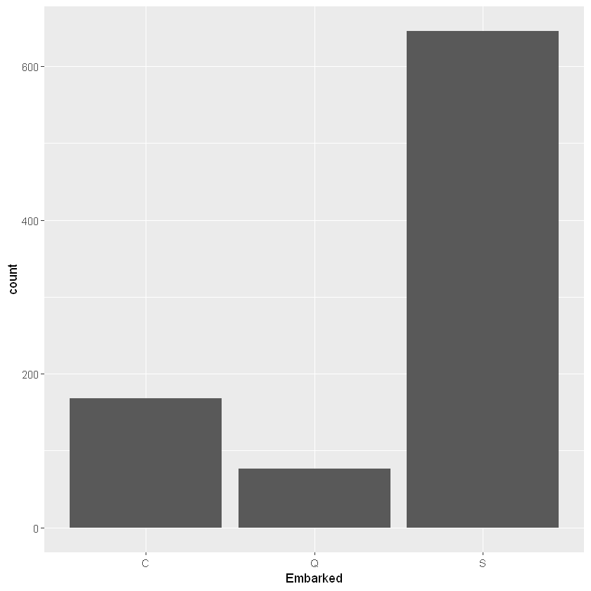
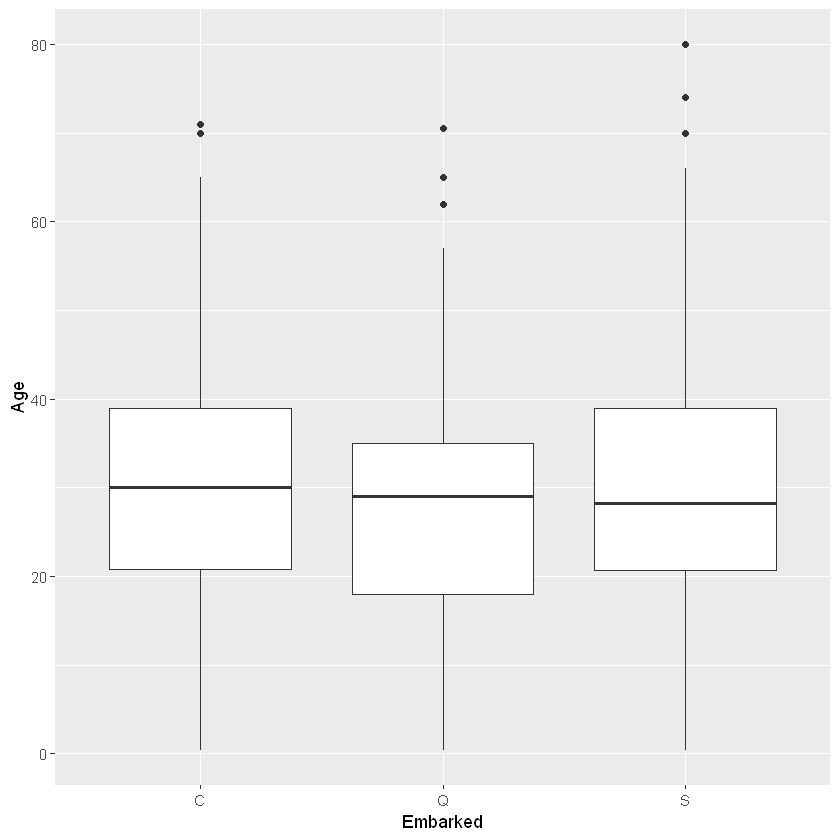

```R
setwd('C:/Users/User/Documents/working on some projects/Kaggle projects/Titanic')
install.packages("mice")
install.packages('stringi')
install.packages('missMDA')
install.packages('MLmetrics')
install.packages('stringr')
install.packages('rpart')
install.packages('extraTrees')
install.packages('randomForest')
install.packages('GPfit')
install.packages('raster')
install.packages('adabag')
install.packages('gbm')
install.packages("xgboost")
install.packages("neuralnet")
library(mice)
library(gbm)
library(missMDA)
library(stringi)
library(stringr)
library(zoo)
library(shiny)
library(ggplot2)
library(xgboost)
library(tidyr)
library(MLmetrics)
library(rpart)
library(stats)
library(extraTrees)
library(e1071)
library(caret)
library(randomForest)
library('GPfit')
library(dplyr)
library(raster)
library(adabag)
library(neuralnet)
```

    Installing package into 'C:/Users/User/Documents/R/win-library/3.6'
    (as 'lib' is unspecified)
    

    package 'mice' successfully unpacked and MD5 sums checked
    
    The downloaded binary packages are in
    	C:\Users\User\AppData\Local\Temp\RtmpwHw3HY\downloaded_packages
    

    Installing package into 'C:/Users/User/Documents/R/win-library/3.6'
    (as 'lib' is unspecified)
    

    package 'stringi' successfully unpacked and MD5 sums checked
    
    The downloaded binary packages are in
    	C:\Users\User\AppData\Local\Temp\RtmpwHw3HY\downloaded_packages
    

    Installing package into 'C:/Users/User/Documents/R/win-library/3.6'
    (as 'lib' is unspecified)
    

    package 'missMDA' successfully unpacked and MD5 sums checked
    
    The downloaded binary packages are in
    	C:\Users\User\AppData\Local\Temp\RtmpwHw3HY\downloaded_packages
    

    Installing package into 'C:/Users/User/Documents/R/win-library/3.6'
    (as 'lib' is unspecified)
    

    package 'MLmetrics' successfully unpacked and MD5 sums checked
    
    The downloaded binary packages are in
    	C:\Users\User\AppData\Local\Temp\RtmpwHw3HY\downloaded_packages
    

    Installing package into 'C:/Users/User/Documents/R/win-library/3.6'
    (as 'lib' is unspecified)
    

    package 'stringr' successfully unpacked and MD5 sums checked
    
    The downloaded binary packages are in
    	C:\Users\User\AppData\Local\Temp\RtmpwHw3HY\downloaded_packages
    

    Installing package into 'C:/Users/User/Documents/R/win-library/3.6'
    (as 'lib' is unspecified)
    

    package 'rpart' successfully unpacked and MD5 sums checked
    
    The downloaded binary packages are in
    	C:\Users\User\AppData\Local\Temp\RtmpwHw3HY\downloaded_packages
    

    Installing package into 'C:/Users/User/Documents/R/win-library/3.6'
    (as 'lib' is unspecified)
    

    package 'extraTrees' successfully unpacked and MD5 sums checked
    
    The downloaded binary packages are in
    	C:\Users\User\AppData\Local\Temp\RtmpwHw3HY\downloaded_packages
    

    Installing package into 'C:/Users/User/Documents/R/win-library/3.6'
    (as 'lib' is unspecified)
    

    package 'randomForest' successfully unpacked and MD5 sums checked
    
    The downloaded binary packages are in
    	C:\Users\User\AppData\Local\Temp\RtmpwHw3HY\downloaded_packages
    

    Installing package into 'C:/Users/User/Documents/R/win-library/3.6'
    (as 'lib' is unspecified)
    

    package 'GPfit' successfully unpacked and MD5 sums checked
    
    The downloaded binary packages are in
    	C:\Users\User\AppData\Local\Temp\RtmpwHw3HY\downloaded_packages
    

    Installing package into 'C:/Users/User/Documents/R/win-library/3.6'
    (as 'lib' is unspecified)
    

    package 'raster' successfully unpacked and MD5 sums checked
    
    The downloaded binary packages are in
    	C:\Users\User\AppData\Local\Temp\RtmpwHw3HY\downloaded_packages
    

    Installing package into 'C:/Users/User/Documents/R/win-library/3.6'
    (as 'lib' is unspecified)
    

    package 'adabag' successfully unpacked and MD5 sums checked
    
    The downloaded binary packages are in
    	C:\Users\User\AppData\Local\Temp\RtmpwHw3HY\downloaded_packages
    

    Installing package into 'C:/Users/User/Documents/R/win-library/3.6'
    (as 'lib' is unspecified)
    

    package 'gbm' successfully unpacked and MD5 sums checked
    
    The downloaded binary packages are in
    	C:\Users\User\AppData\Local\Temp\RtmpwHw3HY\downloaded_packages
    

    Installing package into 'C:/Users/User/Documents/R/win-library/3.6'
    (as 'lib' is unspecified)
    

    package 'xgboost' successfully unpacked and MD5 sums checked
    
    The downloaded binary packages are in
    	C:\Users\User\AppData\Local\Temp\RtmpwHw3HY\downloaded_packages
    

    Installing package into 'C:/Users/User/Documents/R/win-library/3.6'
    (as 'lib' is unspecified)
    

    package 'neuralnet' successfully unpacked and MD5 sums checked
    
    The downloaded binary packages are in
    	C:\Users\User\AppData\Local\Temp\RtmpwHw3HY\downloaded_packages
    

    Loading required package: lattice
    
    Attaching package: 'mice'
    
    The following objects are masked from 'package:base':
    
        cbind, rbind
    
    Loaded gbm 2.1.5
    
    Attaching package: 'zoo'
    
    The following objects are masked from 'package:base':
    
        as.Date, as.Date.numeric
    
    Registered S3 methods overwritten by 'ggplot2':
      method         from 
      [.quosures     rlang
      c.quosures     rlang
      print.quosures rlang
    
    Attaching package: 'tidyr'
    
    The following object is masked from 'package:mice':
    
        complete
    
    
    Attaching package: 'MLmetrics'
    
    The following object is masked from 'package:base':
    
        Recall
    
    Loading required package: rJava
    
    Attaching package: 'caret'
    
    The following objects are masked from 'package:MLmetrics':
    
        MAE, RMSE
    
    randomForest 4.6-14
    Type rfNews() to see new features/changes/bug fixes.
    
    Attaching package: 'randomForest'
    
    The following object is masked from 'package:ggplot2':
    
        margin
    
    
    Attaching package: 'dplyr'
    
    The following object is masked from 'package:randomForest':
    
        combine
    
    The following object is masked from 'package:xgboost':
    
        slice
    
    The following objects are masked from 'package:stats':
    
        filter, lag
    
    The following objects are masked from 'package:base':
    
        intersect, setdiff, setequal, union
    
    Loading required package: sp
    
    Attaching package: 'raster'
    
    The following object is masked from 'package:dplyr':
    
        select
    
    The following object is masked from 'package:e1071':
    
        interpolate
    
    The following object is masked from 'package:tidyr':
    
        extract
    
    Loading required package: foreach
    Loading required package: doParallel
    Loading required package: iterators
    Loading required package: parallel
    
    Attaching package: 'neuralnet'
    
    The following object is masked from 'package:dplyr':
    
        compute
    
    

Downloading of the Data.


```R
train = read.csv('train.csv')
test = read.csv('test.csv')
```

                                           EDA. 

Now lets examine the data we have. 


```R
str(train)
summary(train)
apply(apply(train, 2, is.na),2, sum)
```

    'data.frame':	891 obs. of  12 variables:
     $ PassengerId: int  1 2 3 4 5 6 7 8 9 10 ...
     $ Survived   : int  0 1 1 1 0 0 0 0 1 1 ...
     $ Pclass     : int  3 1 3 1 3 3 1 3 3 2 ...
     $ Name       : Factor w/ 891 levels "Abbing, Mr. Anthony",..: 109 191 358 277 16 559 520 629 417 581 ...
     $ Sex        : Factor w/ 2 levels "female","male": 2 1 1 1 2 2 2 2 1 1 ...
     $ Age        : num  22 38 26 35 35 NA 54 2 27 14 ...
     $ SibSp      : int  1 1 0 1 0 0 0 3 0 1 ...
     $ Parch      : int  0 0 0 0 0 0 0 1 2 0 ...
     $ Ticket     : Factor w/ 681 levels "110152","110413",..: 524 597 670 50 473 276 86 396 345 133 ...
     $ Fare       : num  7.25 71.28 7.92 53.1 8.05 ...
     $ Cabin      : Factor w/ 148 levels "","A10","A14",..: 1 83 1 57 1 1 131 1 1 1 ...
     $ Embarked   : Factor w/ 4 levels "","C","Q","S": 4 2 4 4 4 3 4 4 4 2 ...
    


      PassengerId       Survived          Pclass     
     Min.   :  1.0   Min.   :0.0000   Min.   :1.000  
     1st Qu.:223.5   1st Qu.:0.0000   1st Qu.:2.000  
     Median :446.0   Median :0.0000   Median :3.000  
     Mean   :446.0   Mean   :0.3838   Mean   :2.309  
     3rd Qu.:668.5   3rd Qu.:1.0000   3rd Qu.:3.000  
     Max.   :891.0   Max.   :1.0000   Max.   :3.000  
                                                     
                                        Name         Sex           Age       
     Abbing, Mr. Anthony                  :  1   female:314   Min.   : 0.42  
     Abbott, Mr. Rossmore Edward          :  1   male  :577   1st Qu.:20.12  
     Abbott, Mrs. Stanton (Rosa Hunt)     :  1                Median :28.00  
     Abelson, Mr. Samuel                  :  1                Mean   :29.70  
     Abelson, Mrs. Samuel (Hannah Wizosky):  1                3rd Qu.:38.00  
     Adahl, Mr. Mauritz Nils Martin       :  1                Max.   :80.00  
     (Other)                              :885                NA's   :177    
         SibSp           Parch             Ticket         Fare       
     Min.   :0.000   Min.   :0.0000   1601    :  7   Min.   :  0.00  
     1st Qu.:0.000   1st Qu.:0.0000   347082  :  7   1st Qu.:  7.91  
     Median :0.000   Median :0.0000   CA. 2343:  7   Median : 14.45  
     Mean   :0.523   Mean   :0.3816   3101295 :  6   Mean   : 32.20  
     3rd Qu.:1.000   3rd Qu.:0.0000   347088  :  6   3rd Qu.: 31.00  
     Max.   :8.000   Max.   :6.0000   CA 2144 :  6   Max.   :512.33  
                                      (Other) :852                   
             Cabin     Embarked
                :687    :  2   
     B96 B98    :  4   C:168   
     C23 C25 C27:  4   Q: 77   
     G6         :  4   S:644   
     C22 C26    :  3           
     D          :  3           
     (Other)    :186           


<dl class=dl-horizontal>
	<dt>PassengerId</dt>
		<dd>0</dd>
	<dt>Survived</dt>
		<dd>0</dd>
	<dt>Pclass</dt>
		<dd>0</dd>
	<dt>Name</dt>
		<dd>0</dd>
	<dt>Sex</dt>
		<dd>0</dd>
	<dt>Age</dt>
		<dd>177</dd>
	<dt>SibSp</dt>
		<dd>0</dd>
	<dt>Parch</dt>
		<dd>0</dd>
	<dt>Ticket</dt>
		<dd>0</dd>
	<dt>Fare</dt>
		<dd>0</dd>
	<dt>Cabin</dt>
		<dd>0</dd>
	<dt>Embarked</dt>
		<dd>0</dd>
</dl>


In variable age we have 177 missing values, what really a lot is. And we have to find method to paste it.

Here we write function to leave just numeric values in our dataframe:


```R
conv_to_num = function(x){
   puf = x
   del = 0
   j=0
   for(i in 1:ncol(x)){
       if(!(class(x[,i])%in% c('numeric','integer'))){
         j = j+1
         del[j] = i 
         
       }  
   }
   puf = x[,-del]
  
   return(puf)
} 
```


```R
train_num = conv_to_num(train)
```

Just numeric values. Now we can work with function to input missing data.


```R
imputed = mice(train_num, m=5, maxit = 50, method = 'pmm', seed = 500)
```

    
     iter imp variable
      1   1  Age
      1   2  Age
      1   3  Age
      1   4  Age
      1   5  Age
      2   1  Age
      2   2  Age
      2   3  Age
      2   4  Age
      2   5  Age
      3   1  Age
      3   2  Age
      3   3  Age
      3   4  Age
      3   5  Age
      4   1  Age
      4   2  Age
      4   3  Age
      4   4  Age
      4   5  Age
      5   1  Age
      5   2  Age
      5   3  Age
      5   4  Age
      5   5  Age
      6   1  Age
      6   2  Age
      6   3  Age
      6   4  Age
      6   5  Age
      7   1  Age
      7   2  Age
      7   3  Age
      7   4  Age
      7   5  Age
      8   1  Age
      8   2  Age
      8   3  Age
      8   4  Age
      8   5  Age
      9   1  Age
      9   2  Age
      9   3  Age
      9   4  Age
      9   5  Age
      10   1  Age
      10   2  Age
      10   3  Age
      10   4  Age
      10   5  Age
      11   1  Age
      11   2  Age
      11   3  Age
      11   4  Age
      11   5  Age
      12   1  Age
      12   2  Age
      12   3  Age
      12   4  Age
      12   5  Age
      13   1  Age
      13   2  Age
      13   3  Age
      13   4  Age
      13   5  Age
      14   1  Age
      14   2  Age
      14   3  Age
      14   4  Age
      14   5  Age
      15   1  Age
      15   2  Age
      15   3  Age
      15   4  Age
      15   5  Age
      16   1  Age
      16   2  Age
      16   3  Age
      16   4  Age
      16   5  Age
      17   1  Age
      17   2  Age
      17   3  Age
      17   4  Age
      17   5  Age
      18   1  Age
      18   2  Age
      18   3  Age
      18   4  Age
      18   5  Age
      19   1  Age
      19   2  Age
      19   3  Age
      19   4  Age
      19   5  Age
      20   1  Age
      20   2  Age
      20   3  Age
      20   4  Age
      20   5  Age
      21   1  Age
      21   2  Age
      21   3  Age
      21   4  Age
      21   5  Age
      22   1  Age
      22   2  Age
      22   3  Age
      22   4  Age
      22   5  Age
      23   1  Age
      23   2  Age
      23   3  Age
      23   4  Age
      23   5  Age
      24   1  Age
      24   2  Age
      24   3  Age
      24   4  Age
      24   5  Age
      25   1  Age
      25   2  Age
      25   3  Age
      25   4  Age
      25   5  Age
      26   1  Age
      26   2  Age
      26   3  Age
      26   4  Age
      26   5  Age
      27   1  Age
      27   2  Age
      27   3  Age
      27   4  Age
      27   5  Age
      28   1  Age
      28   2  Age
      28   3  Age
      28   4  Age
      28   5  Age
      29   1  Age
      29   2  Age
      29   3  Age
      29   4  Age
      29   5  Age
      30   1  Age
      30   2  Age
      30   3  Age
      30   4  Age
      30   5  Age
      31   1  Age
      31   2  Age
      31   3  Age
      31   4  Age
      31   5  Age
      32   1  Age
      32   2  Age
      32   3  Age
      32   4  Age
      32   5  Age
      33   1  Age
      33   2  Age
      33   3  Age
      33   4  Age
      33   5  Age
      34   1  Age
      34   2  Age
      34   3  Age
      34   4  Age
      34   5  Age
      35   1  Age
      35   2  Age
      35   3  Age
      35   4  Age
      35   5  Age
      36   1  Age
      36   2  Age
      36   3  Age
      36   4  Age
      36   5  Age
      37   1  Age
      37   2  Age
      37   3  Age
      37   4  Age
      37   5  Age
      38   1  Age
      38   2  Age
      38   3  Age
      38   4  Age
      38   5  Age
      39   1  Age
      39   2  Age
      39   3  Age
      39   4  Age
      39   5  Age
      40   1  Age
      40   2  Age
      40   3  Age
      40   4  Age
      40   5  Age
      41   1  Age
      41   2  Age
      41   3  Age
      41   4  Age
      41   5  Age
      42   1  Age
      42   2  Age
      42   3  Age
      42   4  Age
      42   5  Age
      43   1  Age
      43   2  Age
      43   3  Age
      43   4  Age
      43   5  Age
      44   1  Age
      44   2  Age
      44   3  Age
      44   4  Age
      44   5  Age
      45   1  Age
      45   2  Age
      45   3  Age
      45   4  Age
      45   5  Age
      46   1  Age
      46   2  Age
      46   3  Age
      46   4  Age
      46   5  Age
      47   1  Age
      47   2  Age
      47   3  Age
      47   4  Age
      47   5  Age
      48   1  Age
      48   2  Age
      48   3  Age
      48   4  Age
      48   5  Age
      49   1  Age
      49   2  Age
      49   3  Age
      49   4  Age
      49   5  Age
      50   1  Age
      50   2  Age
      50   3  Age
      50   4  Age
      50   5  Age
    

We used here for imputation  'Predictive mean matching'. Explanation:
Predictive mean matching calculates the predicted value of target variable Y according to the specified imputation model. 
For each missing entry, the method forms a small set of candidate donors (typically with 3, 5 or 10 members) from all complete cases
that have predicted values closest to the predicted value for the missing entry.
One donor is randomly drawn from the candidates, and the observed value of the donor is taken to replace the missing value. 
The assumption is the distribution of the missing cell is the same as the observed data of the candidate donors.


```R
summary(imputed)

```

    Class: mids
    Number of multiple imputations:  5 
    Imputation methods:
    PassengerId    Survived      Pclass         Age       SibSp       Parch 
             ""          ""          ""       "pmm"          ""          "" 
           Fare 
             "" 
    PredictorMatrix:
                PassengerId Survived Pclass Age SibSp Parch Fare
    PassengerId           0        1      1   1     1     1    1
    Survived              1        0      1   1     1     1    1
    Pclass                1        1      0   1     1     1    1
    Age                   1        1      1   0     1     1    1
    SibSp                 1        1      1   1     0     1    1
    Parch                 1        1      1   1     1     0    1
    


```R
mice::complete(imputed,2)
```


<table>
<caption>A data.frame: 891 × 7</caption>
<thead>
	<tr><th scope=col>PassengerId</th><th scope=col>Survived</th><th scope=col>Pclass</th><th scope=col>Age</th><th scope=col>SibSp</th><th scope=col>Parch</th><th scope=col>Fare</th></tr>
	<tr><th scope=col>&lt;int&gt;</th><th scope=col>&lt;int&gt;</th><th scope=col>&lt;int&gt;</th><th scope=col>&lt;dbl&gt;</th><th scope=col>&lt;int&gt;</th><th scope=col>&lt;int&gt;</th><th scope=col>&lt;dbl&gt;</th></tr>
</thead>
<tbody>
	<tr><td> 1</td><td>0</td><td>3</td><td>22</td><td>1</td><td>0</td><td>  7.2500</td></tr>
	<tr><td> 2</td><td>1</td><td>1</td><td>38</td><td>1</td><td>0</td><td> 71.2833</td></tr>
	<tr><td> 3</td><td>1</td><td>3</td><td>26</td><td>0</td><td>0</td><td>  7.9250</td></tr>
	<tr><td> 4</td><td>1</td><td>1</td><td>35</td><td>1</td><td>0</td><td> 53.1000</td></tr>
	<tr><td> 5</td><td>0</td><td>3</td><td>35</td><td>0</td><td>0</td><td>  8.0500</td></tr>
	<tr><td> 6</td><td>0</td><td>3</td><td>45</td><td>0</td><td>0</td><td>  8.4583</td></tr>
	<tr><td> 7</td><td>0</td><td>1</td><td>54</td><td>0</td><td>0</td><td> 51.8625</td></tr>
	<tr><td> 8</td><td>0</td><td>3</td><td> 2</td><td>3</td><td>1</td><td> 21.0750</td></tr>
	<tr><td> 9</td><td>1</td><td>3</td><td>27</td><td>0</td><td>2</td><td> 11.1333</td></tr>
	<tr><td>10</td><td>1</td><td>2</td><td>14</td><td>1</td><td>0</td><td> 30.0708</td></tr>
	<tr><td>11</td><td>1</td><td>3</td><td> 4</td><td>1</td><td>1</td><td> 16.7000</td></tr>
	<tr><td>12</td><td>1</td><td>1</td><td>58</td><td>0</td><td>0</td><td> 26.5500</td></tr>
	<tr><td>13</td><td>0</td><td>3</td><td>20</td><td>0</td><td>0</td><td>  8.0500</td></tr>
	<tr><td>14</td><td>0</td><td>3</td><td>39</td><td>1</td><td>5</td><td> 31.2750</td></tr>
	<tr><td>15</td><td>0</td><td>3</td><td>14</td><td>0</td><td>0</td><td>  7.8542</td></tr>
	<tr><td>16</td><td>1</td><td>2</td><td>55</td><td>0</td><td>0</td><td> 16.0000</td></tr>
	<tr><td>17</td><td>0</td><td>3</td><td> 2</td><td>4</td><td>1</td><td> 29.1250</td></tr>
	<tr><td>18</td><td>1</td><td>2</td><td>14</td><td>0</td><td>0</td><td> 13.0000</td></tr>
	<tr><td>19</td><td>0</td><td>3</td><td>31</td><td>1</td><td>0</td><td> 18.0000</td></tr>
	<tr><td>20</td><td>1</td><td>3</td><td>29</td><td>0</td><td>0</td><td>  7.2250</td></tr>
	<tr><td>21</td><td>0</td><td>2</td><td>35</td><td>0</td><td>0</td><td> 26.0000</td></tr>
	<tr><td>22</td><td>1</td><td>2</td><td>34</td><td>0</td><td>0</td><td> 13.0000</td></tr>
	<tr><td>23</td><td>1</td><td>3</td><td>15</td><td>0</td><td>0</td><td>  8.0292</td></tr>
	<tr><td>24</td><td>1</td><td>1</td><td>28</td><td>0</td><td>0</td><td> 35.5000</td></tr>
	<tr><td>25</td><td>0</td><td>3</td><td> 8</td><td>3</td><td>1</td><td> 21.0750</td></tr>
	<tr><td>26</td><td>1</td><td>3</td><td>38</td><td>1</td><td>5</td><td> 31.3875</td></tr>
	<tr><td>27</td><td>0</td><td>3</td><td>42</td><td>0</td><td>0</td><td>  7.2250</td></tr>
	<tr><td>28</td><td>0</td><td>1</td><td>19</td><td>3</td><td>2</td><td>263.0000</td></tr>
	<tr><td>29</td><td>1</td><td>3</td><td>26</td><td>0</td><td>0</td><td>  7.8792</td></tr>
	<tr><td>30</td><td>0</td><td>3</td><td>27</td><td>0</td><td>0</td><td>  7.8958</td></tr>
	<tr><td>...</td><td>...</td><td>...</td><td>...</td><td>...</td><td>...</td><td>...</td></tr>
	<tr><td>862</td><td>0</td><td>2</td><td>21</td><td>1</td><td>0</td><td>11.5000</td></tr>
	<tr><td>863</td><td>1</td><td>1</td><td>48</td><td>0</td><td>0</td><td>25.9292</td></tr>
	<tr><td>864</td><td>0</td><td>3</td><td> 3</td><td>8</td><td>2</td><td>69.5500</td></tr>
	<tr><td>865</td><td>0</td><td>2</td><td>24</td><td>0</td><td>0</td><td>13.0000</td></tr>
	<tr><td>866</td><td>1</td><td>2</td><td>42</td><td>0</td><td>0</td><td>13.0000</td></tr>
	<tr><td>867</td><td>1</td><td>2</td><td>27</td><td>1</td><td>0</td><td>13.8583</td></tr>
	<tr><td>868</td><td>0</td><td>1</td><td>31</td><td>0</td><td>0</td><td>50.4958</td></tr>
	<tr><td>869</td><td>0</td><td>3</td><td>13</td><td>0</td><td>0</td><td> 9.5000</td></tr>
	<tr><td>870</td><td>1</td><td>3</td><td> 4</td><td>1</td><td>1</td><td>11.1333</td></tr>
	<tr><td>871</td><td>0</td><td>3</td><td>26</td><td>0</td><td>0</td><td> 7.8958</td></tr>
	<tr><td>872</td><td>1</td><td>1</td><td>47</td><td>1</td><td>1</td><td>52.5542</td></tr>
	<tr><td>873</td><td>0</td><td>1</td><td>33</td><td>0</td><td>0</td><td> 5.0000</td></tr>
	<tr><td>874</td><td>0</td><td>3</td><td>47</td><td>0</td><td>0</td><td> 9.0000</td></tr>
	<tr><td>875</td><td>1</td><td>2</td><td>28</td><td>1</td><td>0</td><td>24.0000</td></tr>
	<tr><td>876</td><td>1</td><td>3</td><td>15</td><td>0</td><td>0</td><td> 7.2250</td></tr>
	<tr><td>877</td><td>0</td><td>3</td><td>20</td><td>0</td><td>0</td><td> 9.8458</td></tr>
	<tr><td>878</td><td>0</td><td>3</td><td>19</td><td>0</td><td>0</td><td> 7.8958</td></tr>
	<tr><td>879</td><td>0</td><td>3</td><td>25</td><td>0</td><td>0</td><td> 7.8958</td></tr>
	<tr><td>880</td><td>1</td><td>1</td><td>56</td><td>0</td><td>1</td><td>83.1583</td></tr>
	<tr><td>881</td><td>1</td><td>2</td><td>25</td><td>0</td><td>1</td><td>26.0000</td></tr>
	<tr><td>882</td><td>0</td><td>3</td><td>33</td><td>0</td><td>0</td><td> 7.8958</td></tr>
	<tr><td>883</td><td>0</td><td>3</td><td>22</td><td>0</td><td>0</td><td>10.5167</td></tr>
	<tr><td>884</td><td>0</td><td>2</td><td>28</td><td>0</td><td>0</td><td>10.5000</td></tr>
	<tr><td>885</td><td>0</td><td>3</td><td>25</td><td>0</td><td>0</td><td> 7.0500</td></tr>
	<tr><td>886</td><td>0</td><td>3</td><td>39</td><td>0</td><td>5</td><td>29.1250</td></tr>
	<tr><td>887</td><td>0</td><td>2</td><td>27</td><td>0</td><td>0</td><td>13.0000</td></tr>
	<tr><td>888</td><td>1</td><td>1</td><td>19</td><td>0</td><td>0</td><td>30.0000</td></tr>
	<tr><td>889</td><td>0</td><td>3</td><td>48</td><td>1</td><td>2</td><td>23.4500</td></tr>
	<tr><td>890</td><td>1</td><td>1</td><td>26</td><td>0</td><td>0</td><td>30.0000</td></tr>
	<tr><td>891</td><td>0</td><td>3</td><td>32</td><td>0</td><td>0</td><td> 7.7500</td></tr>
</tbody>
</table>


From 5 datasets that we have i will take 2nd.

Now we have to put 'Age' variable in our Dataset.


```R
train[,'Age'] = mice::complete(imputed, 2)[['Age']]
```

Now we dont have any missing values.


```R
as.character(train$Cabin)
```


<ol class=list-inline>
	<li>''</li>
	<li>'C85'</li>
	<li>''</li>
	<li>'C123'</li>
	<li>''</li>
	<li>''</li>
	<li>'E46'</li>
	<li>''</li>
	<li>''</li>
	<li>''</li>
	<li>'G6'</li>
	<li>'C103'</li>
	<li>''</li>
	<li>''</li>
	<li>''</li>
	<li>''</li>
	<li>''</li>
	<li>''</li>
	<li>''</li>
	<li>''</li>
	<li>''</li>
	<li>'D56'</li>
	<li>''</li>
	<li>'A6'</li>
	<li>''</li>
	<li>''</li>
	<li>''</li>
	<li>'C23 C25 C27'</li>
	<li>''</li>
	<li>''</li>
	<li>''</li>
	<li>'B78'</li>
	<li>''</li>
	<li>''</li>
	<li>''</li>
	<li>''</li>
	<li>''</li>
	<li>''</li>
	<li>''</li>
	<li>''</li>
	<li>''</li>
	<li>''</li>
	<li>''</li>
	<li>''</li>
	<li>''</li>
	<li>''</li>
	<li>''</li>
	<li>''</li>
	<li>''</li>
	<li>''</li>
	<li>''</li>
	<li>''</li>
	<li>'D33'</li>
	<li>''</li>
	<li>'B30'</li>
	<li>'C52'</li>
	<li>''</li>
	<li>''</li>
	<li>''</li>
	<li>''</li>
	<li>''</li>
	<li>'B28'</li>
	<li>'C83'</li>
	<li>''</li>
	<li>''</li>
	<li>''</li>
	<li>'F33'</li>
	<li>''</li>
	<li>''</li>
	<li>''</li>
	<li>''</li>
	<li>''</li>
	<li>''</li>
	<li>''</li>
	<li>''</li>
	<li>'F G73'</li>
	<li>''</li>
	<li>''</li>
	<li>''</li>
	<li>''</li>
	<li>''</li>
	<li>''</li>
	<li>''</li>
	<li>''</li>
	<li>''</li>
	<li>''</li>
	<li>''</li>
	<li>''</li>
	<li>'C23 C25 C27'</li>
	<li>''</li>
	<li>''</li>
	<li>''</li>
	<li>'E31'</li>
	<li>''</li>
	<li>''</li>
	<li>''</li>
	<li>'A5'</li>
	<li>'D10 D12'</li>
	<li>''</li>
	<li>''</li>
	<li>''</li>
	<li>''</li>
	<li>'D26'</li>
	<li>''</li>
	<li>''</li>
	<li>''</li>
	<li>''</li>
	<li>''</li>
	<li>''</li>
	<li>''</li>
	<li>'C110'</li>
	<li>''</li>
	<li>''</li>
	<li>''</li>
	<li>''</li>
	<li>''</li>
	<li>''</li>
	<li>''</li>
	<li>'B58 B60'</li>
	<li>''</li>
	<li>''</li>
	<li>''</li>
	<li>''</li>
	<li>'E101'</li>
	<li>'D26'</li>
	<li>''</li>
	<li>''</li>
	<li>''</li>
	<li>'F E69'</li>
	<li>''</li>
	<li>''</li>
	<li>''</li>
	<li>''</li>
	<li>''</li>
	<li>''</li>
	<li>''</li>
	<li>'D47'</li>
	<li>'C123'</li>
	<li>''</li>
	<li>'B86'</li>
	<li>''</li>
	<li>''</li>
	<li>''</li>
	<li>''</li>
	<li>''</li>
	<li>''</li>
	<li>''</li>
	<li>''</li>
	<li>'F2'</li>
	<li>''</li>
	<li>''</li>
	<li>'C2'</li>
	<li>''</li>
	<li>''</li>
	<li>''</li>
	<li>''</li>
	<li>''</li>
	<li>''</li>
	<li>''</li>
	<li>''</li>
	<li>''</li>
	<li>''</li>
	<li>''</li>
	<li>''</li>
	<li>''</li>
	<li>''</li>
	<li>'E33'</li>
	<li>''</li>
	<li>''</li>
	<li>''</li>
	<li>'B19'</li>
	<li>''</li>
	<li>''</li>
	<li>''</li>
	<li>'A7'</li>
	<li>''</li>
	<li>''</li>
	<li>'C49'</li>
	<li>''</li>
	<li>''</li>
	<li>''</li>
	<li>''</li>
	<li>''</li>
	<li>'F4'</li>
	<li>''</li>
	<li>'A32'</li>
	<li>''</li>
	<li>''</li>
	<li>''</li>
	<li>''</li>
	<li>''</li>
	<li>''</li>
	<li>''</li>
	<li>'F2'</li>
	<li>'B4'</li>
	<li>'B80'</li>
	<li>''</li>
	<li>''</li>
	<li>''</li>
	<li>''</li>
	<li>''</li>
	<li>''</li>
	<li>''</li>
	<li>''</li>
	<li>''</li>
	<li>'G6'</li>
	<li>''</li>
	<li>''</li>
	<li>''</li>
	<li>'A31'</li>
	<li>''</li>
	<li>''</li>
	<li>''</li>
	<li>''</li>
	<li>''</li>
	<li>'D36'</li>
	<li>''</li>
	<li>''</li>
	<li>'D15'</li>
	<li>''</li>
	<li>''</li>
	<li>''</li>
	<li>''</li>
	<li>''</li>
	<li>'C93'</li>
	<li>''</li>
	<li>''</li>
	<li>''</li>
	<li>''</li>
	<li>''</li>
	<li>'C83'</li>
	<li>''</li>
	<li>''</li>
	<li>''</li>
	<li>''</li>
	<li>''</li>
	<li>''</li>
	<li>''</li>
	<li>''</li>
	<li>''</li>
	<li>''</li>
	<li>''</li>
	<li>''</li>
	<li>''</li>
	<li>''</li>
	<li>'C78'</li>
	<li>''</li>
	<li>''</li>
	<li>'D35'</li>
	<li>''</li>
	<li>''</li>
	<li>'G6'</li>
	<li>'C87'</li>
	<li>''</li>
	<li>''</li>
	<li>''</li>
	<li>''</li>
	<li>'B77'</li>
	<li>''</li>
	<li>''</li>
	<li>''</li>
	<li>''</li>
	<li>'E67'</li>
	<li>'B94'</li>
	<li>''</li>
	<li>''</li>
	<li>''</li>
	<li>''</li>
	<li>'C125'</li>
	<li>'C99'</li>
	<li>''</li>
	<li>''</li>
	<li>''</li>
	<li>'C118'</li>
	<li>''</li>
	<li>'D7'</li>
	<li>''</li>
	<li>''</li>
	<li>''</li>
	<li>''</li>
	<li>''</li>
	<li>''</li>
	<li>''</li>
	<li>''</li>
	<li>'A19'</li>
	<li>''</li>
	<li>''</li>
	<li>''</li>
	<li>''</li>
	<li>''</li>
	<li>''</li>
	<li>'B49'</li>
	<li>'D'</li>
	<li>''</li>
	<li>''</li>
	<li>''</li>
	<li>''</li>
	<li>'C22 C26'</li>
	<li>'C106'</li>
	<li>'B58 B60'</li>
	<li>''</li>
	<li>''</li>
	<li>''</li>
	<li>'E101'</li>
	<li>''</li>
	<li>'C22 C26'</li>
	<li>''</li>
	<li>'C65'</li>
	<li>''</li>
	<li>'E36'</li>
	<li>'C54'</li>
	<li>'B57 B59 B63 B66'</li>
	<li>''</li>
	<li>''</li>
	<li>''</li>
	<li>''</li>
	<li>''</li>
	<li>''</li>
	<li>'C7'</li>
	<li>'E34'</li>
	<li>''</li>
	<li>''</li>
	<li>''</li>
	<li>''</li>
	<li>''</li>
	<li>'C32'</li>
	<li>''</li>
	<li>'D'</li>
	<li>''</li>
	<li>'B18'</li>
	<li>''</li>
	<li>'C124'</li>
	<li>'C91'</li>
	<li>''</li>
	<li>''</li>
	<li>''</li>
	<li>'C2'</li>
	<li>'E40'</li>
	<li>''</li>
	<li>'T'</li>
	<li>'F2'</li>
	<li>'C23 C25 C27'</li>
	<li>''</li>
	<li>''</li>
	<li>''</li>
	<li>'F33'</li>
	<li>''</li>
	<li>''</li>
	<li>''</li>
	<li>''</li>
	<li>''</li>
	<li>'C128'</li>
	<li>''</li>
	<li>''</li>
	<li>''</li>
	<li>''</li>
	<li>'E33'</li>
	<li>''</li>
	<li>''</li>
	<li>''</li>
	<li>''</li>
	<li>''</li>
	<li>''</li>
	<li>''</li>
	<li>''</li>
	<li>''</li>
	<li>'D37'</li>
	<li>''</li>
	<li>''</li>
	<li>'B35'</li>
	<li>'E50'</li>
	<li>''</li>
	<li>''</li>
	<li>''</li>
	<li>''</li>
	<li>''</li>
	<li>''</li>
	<li>'C82'</li>
	<li>''</li>
	<li>''</li>
	<li>''</li>
	<li>''</li>
	<li>''</li>
	<li>''</li>
	<li>''</li>
	<li>''</li>
	<li>''</li>
	<li>''</li>
	<li>''</li>
	<li>''</li>
	<li>'B96 B98'</li>
	<li>''</li>
	<li>''</li>
	<li>'D36'</li>
	<li>'G6'</li>
	<li>''</li>
	<li>''</li>
	<li>''</li>
	<li>''</li>
	<li>''</li>
	<li>''</li>
	<li>''</li>
	<li>''</li>
	<li>''</li>
	<li>''</li>
	<li>''</li>
	<li>''</li>
	<li>''</li>
	<li>''</li>
	<li>''</li>
	<li>''</li>
	<li>''</li>
	<li>'C78'</li>
	<li>''</li>
	<li>''</li>
	<li>''</li>
	<li>''</li>
	<li>''</li>
	<li>''</li>
	<li>''</li>
	<li>''</li>
	<li>''</li>
	<li>''</li>
	<li>''</li>
	<li>''</li>
	<li>''</li>
	<li>''</li>
	<li>''</li>
	<li>''</li>
	<li>'E10'</li>
	<li>'C52'</li>
	<li>''</li>
	<li>''</li>
	<li>''</li>
	<li>'E44'</li>
	<li>'B96 B98'</li>
	<li>''</li>
	<li>''</li>
	<li>'C23 C25 C27'</li>
	<li>''</li>
	<li>''</li>
	<li>''</li>
	<li>''</li>
	<li>''</li>
	<li>''</li>
	<li>'A34'</li>
	<li>''</li>
	<li>''</li>
	<li>''</li>
	<li>'C104'</li>
	<li>''</li>
	<li>''</li>
	<li>'C111'</li>
	<li>'C92'</li>
	<li>''</li>
	<li>''</li>
	<li>'E38'</li>
	<li>'D21'</li>
	<li>''</li>
	<li>''</li>
	<li>'E12'</li>
	<li>''</li>
	<li>'E63'</li>
	<li>''</li>
	<li>''</li>
	<li>''</li>
	<li>''</li>
	<li>''</li>
	<li>''</li>
	<li>''</li>
	<li>''</li>
	<li>''</li>
	<li>''</li>
	<li>'D'</li>
	<li>''</li>
	<li>'A14'</li>
	<li>''</li>
	<li>''</li>
	<li>''</li>
	<li>''</li>
	<li>''</li>
	<li>''</li>
	<li>''</li>
	<li>''</li>
	<li>'B49'</li>
	<li>''</li>
	<li>'C93'</li>
	<li>'B37'</li>
	<li>''</li>
	<li>''</li>
	<li>''</li>
	<li>''</li>
	<li>'C30'</li>
	<li>''</li>
	<li>''</li>
	<li>''</li>
	<li>'D20'</li>
	<li>''</li>
	<li>'C22 C26'</li>
	<li>''</li>
	<li>''</li>
	<li>''</li>
	<li>''</li>
	<li>''</li>
	<li>'B79'</li>
	<li>'C65'</li>
	<li>''</li>
	<li>''</li>
	<li>''</li>
	<li>''</li>
	<li>''</li>
	<li>''</li>
	<li>'E25'</li>
	<li>''</li>
	<li>''</li>
	<li>'D46'</li>
	<li>'F33'</li>
	<li>''</li>
	<li>''</li>
	<li>''</li>
	<li>'B73'</li>
	<li>''</li>
	<li>''</li>
	<li>'B18'</li>
	<li>''</li>
	<li>''</li>
	<li>''</li>
	<li>'C95'</li>
	<li>''</li>
	<li>''</li>
	<li>''</li>
	<li>''</li>
	<li>''</li>
	<li>''</li>
	<li>''</li>
	<li>''</li>
	<li>'B38'</li>
	<li>''</li>
	<li>''</li>
	<li>'B39'</li>
	<li>'B22'</li>
	<li>''</li>
	<li>''</li>
	<li>''</li>
	<li>'C86'</li>
	<li>''</li>
	<li>''</li>
	<li>''</li>
	<li>''</li>
	<li>''</li>
	<li>'C70'</li>
	<li>''</li>
	<li>''</li>
	<li>''</li>
	<li>''</li>
	<li>''</li>
	<li>'A16'</li>
	<li>''</li>
	<li>'E67'</li>
	<li>''</li>
	<li>''</li>
	<li>''</li>
	<li>''</li>
	<li>''</li>
	<li>''</li>
	<li>''</li>
	<li>''</li>
	<li>''</li>
	<li>''</li>
	<li>''</li>
	<li>''</li>
	<li>'C101'</li>
	<li>'E25'</li>
	<li>''</li>
	<li>''</li>
	<li>''</li>
	<li>''</li>
	<li>'E44'</li>
	<li>''</li>
	<li>''</li>
	<li>''</li>
	<li>'C68'</li>
	<li>''</li>
	<li>'A10'</li>
	<li>''</li>
	<li>'E68'</li>
	<li>''</li>
	<li>'B41'</li>
	<li>''</li>
	<li>''</li>
	<li>''</li>
	<li>'D20'</li>
	<li>''</li>
	<li>''</li>
	<li>''</li>
	<li>''</li>
	<li>''</li>
	<li>''</li>
	<li>''</li>
	<li>'A20'</li>
	<li>''</li>
	<li>''</li>
	<li>''</li>
	<li>''</li>
	<li>''</li>
	<li>''</li>
	<li>''</li>
	<li>''</li>
	<li>''</li>
	<li>'C125'</li>
	<li>''</li>
	<li>''</li>
	<li>''</li>
	<li>''</li>
	<li>''</li>
	<li>''</li>
	<li>''</li>
	<li>''</li>
	<li>'F4'</li>
	<li>''</li>
	<li>''</li>
	<li>'D19'</li>
	<li>''</li>
	<li>''</li>
	<li>''</li>
	<li>'D50'</li>
	<li>''</li>
	<li>'D9'</li>
	<li>''</li>
	<li>''</li>
	<li>'A23'</li>
	<li>''</li>
	<li>'B50'</li>
	<li>''</li>
	<li>''</li>
	<li>''</li>
	<li>''</li>
	<li>''</li>
	<li>''</li>
	<li>''</li>
	<li>''</li>
	<li>'B35'</li>
	<li>''</li>
	<li>''</li>
	<li>''</li>
	<li>'D33'</li>
	<li>''</li>
	<li>'A26'</li>
	<li>''</li>
	<li>''</li>
	<li>''</li>
	<li>''</li>
	<li>''</li>
	<li>''</li>
	<li>''</li>
	<li>''</li>
	<li>''</li>
	<li>''</li>
	<li>''</li>
	<li>'D48'</li>
	<li>''</li>
	<li>''</li>
	<li>'E58'</li>
	<li>''</li>
	<li>''</li>
	<li>''</li>
	<li>''</li>
	<li>''</li>
	<li>''</li>
	<li>'C126'</li>
	<li>''</li>
	<li>'B71'</li>
	<li>''</li>
	<li>''</li>
	<li>''</li>
	<li>''</li>
	<li>''</li>
	<li>''</li>
	<li>''</li>
	<li>'B51 B53 B55'</li>
	<li>''</li>
	<li>'D49'</li>
	<li>''</li>
	<li>''</li>
	<li>''</li>
	<li>''</li>
	<li>''</li>
	<li>''</li>
	<li>''</li>
	<li>'B5'</li>
	<li>'B20'</li>
	<li>''</li>
	<li>''</li>
	<li>''</li>
	<li>''</li>
	<li>''</li>
	<li>''</li>
	<li>''</li>
	<li>'C68'</li>
	<li>'F G63'</li>
	<li>'C62 C64'</li>
	<li>'E24'</li>
	<li>''</li>
	<li>''</li>
	<li>''</li>
	<li>''</li>
	<li>''</li>
	<li>'E24'</li>
	<li>''</li>
	<li>''</li>
	<li>'C90'</li>
	<li>'C124'</li>
	<li>'C126'</li>
	<li>''</li>
	<li>''</li>
	<li>'F G73'</li>
	<li>'C45'</li>
	<li>'E101'</li>
	<li>''</li>
	<li>''</li>
	<li>''</li>
	<li>''</li>
	<li>''</li>
	<li>''</li>
	<li>'E8'</li>
	<li>''</li>
	<li>''</li>
	<li>''</li>
	<li>''</li>
	<li>''</li>
	<li>'B5'</li>
	<li>''</li>
	<li>''</li>
	<li>''</li>
	<li>''</li>
	<li>''</li>
	<li>''</li>
	<li>'B101'</li>
	<li>''</li>
	<li>''</li>
	<li>'D45'</li>
	<li>'C46'</li>
	<li>'B57 B59 B63 B66'</li>
	<li>''</li>
	<li>''</li>
	<li>'B22'</li>
	<li>''</li>
	<li>''</li>
	<li>'D30'</li>
	<li>''</li>
	<li>''</li>
	<li>'E121'</li>
	<li>''</li>
	<li>''</li>
	<li>''</li>
	<li>''</li>
	<li>''</li>
	<li>''</li>
	<li>''</li>
	<li>'B77'</li>
	<li>''</li>
	<li>''</li>
	<li>''</li>
	<li>'B96 B98'</li>
	<li>''</li>
	<li>'D11'</li>
	<li>''</li>
	<li>''</li>
	<li>''</li>
	<li>''</li>
	<li>''</li>
	<li>''</li>
	<li>'E77'</li>
	<li>''</li>
	<li>''</li>
	<li>''</li>
	<li>'F38'</li>
	<li>''</li>
	<li>''</li>
	<li>'B3'</li>
	<li>''</li>
	<li>'B20'</li>
	<li>'D6'</li>
	<li>''</li>
	<li>''</li>
	<li>''</li>
	<li>''</li>
	<li>''</li>
	<li>''</li>
	<li>'B82 B84'</li>
	<li>''</li>
	<li>''</li>
	<li>''</li>
	<li>''</li>
	<li>''</li>
	<li>''</li>
	<li>'D17'</li>
	<li>''</li>
	<li>''</li>
	<li>''</li>
	<li>''</li>
	<li>''</li>
	<li>'B96 B98'</li>
	<li>''</li>
	<li>''</li>
	<li>''</li>
	<li>'A36'</li>
	<li>''</li>
	<li>''</li>
	<li>'E8'</li>
	<li>''</li>
	<li>''</li>
	<li>''</li>
	<li>''</li>
	<li>''</li>
	<li>'B102'</li>
	<li>''</li>
	<li>''</li>
	<li>''</li>
	<li>''</li>
	<li>'B69'</li>
	<li>''</li>
	<li>''</li>
	<li>'E121'</li>
	<li>''</li>
	<li>''</li>
	<li>''</li>
	<li>''</li>
	<li>''</li>
	<li>'B28'</li>
	<li>''</li>
	<li>''</li>
	<li>''</li>
	<li>''</li>
	<li>''</li>
	<li>'E49'</li>
	<li>''</li>
	<li>''</li>
	<li>''</li>
	<li>'C47'</li>
	<li>''</li>
	<li>''</li>
	<li>''</li>
	<li>''</li>
	<li>''</li>
	<li>''</li>
	<li>''</li>
	<li>''</li>
	<li>''</li>
	<li>'C92'</li>
	<li>''</li>
	<li>''</li>
	<li>''</li>
	<li>'D28'</li>
	<li>''</li>
	<li>''</li>
	<li>''</li>
	<li>'E17'</li>
	<li>''</li>
	<li>''</li>
	<li>''</li>
	<li>''</li>
	<li>'D17'</li>
	<li>''</li>
	<li>''</li>
	<li>''</li>
	<li>''</li>
	<li>'A24'</li>
	<li>''</li>
	<li>''</li>
	<li>''</li>
	<li>'D35'</li>
	<li>'B51 B53 B55'</li>
	<li>''</li>
	<li>''</li>
	<li>''</li>
	<li>''</li>
	<li>''</li>
	<li>''</li>
	<li>'C50'</li>
	<li>''</li>
	<li>''</li>
	<li>''</li>
	<li>''</li>
	<li>''</li>
	<li>''</li>
	<li>''</li>
	<li>'B42'</li>
	<li>''</li>
	<li>'C148'</li>
	<li>''</li>
</ol>


The most information about cabin is unfortunately lost. Therefore this variable wouldnt be so useful in our analysis. We will drop it:


```R
 train = train[,-11]
```

We see that we have some missing data in 'Embarked' variable:


```R
train$Embarked
```


<ol class=list-inline>
	<li>S</li>
	<li>C</li>
	<li>S</li>
	<li>S</li>
	<li>S</li>
	<li>Q</li>
	<li>S</li>
	<li>S</li>
	<li>S</li>
	<li>C</li>
	<li>S</li>
	<li>S</li>
	<li>S</li>
	<li>S</li>
	<li>S</li>
	<li>S</li>
	<li>Q</li>
	<li>S</li>
	<li>S</li>
	<li>C</li>
	<li>S</li>
	<li>S</li>
	<li>Q</li>
	<li>S</li>
	<li>S</li>
	<li>S</li>
	<li>C</li>
	<li>S</li>
	<li>Q</li>
	<li>S</li>
	<li>C</li>
	<li>C</li>
	<li>Q</li>
	<li>S</li>
	<li>C</li>
	<li>S</li>
	<li>C</li>
	<li>S</li>
	<li>S</li>
	<li>C</li>
	<li>S</li>
	<li>S</li>
	<li>C</li>
	<li>C</li>
	<li>Q</li>
	<li>S</li>
	<li>Q</li>
	<li>Q</li>
	<li>C</li>
	<li>S</li>
	<li>S</li>
	<li>S</li>
	<li>C</li>
	<li>S</li>
	<li>C</li>
	<li>S</li>
	<li>S</li>
	<li>C</li>
	<li>S</li>
	<li>S</li>
	<li>C</li>
	<li></li>
	<li>S</li>
	<li>S</li>
	<li>C</li>
	<li>C</li>
	<li>S</li>
	<li>S</li>
	<li>S</li>
	<li>S</li>
	<li>S</li>
	<li>S</li>
	<li>S</li>
	<li>C</li>
	<li>S</li>
	<li>S</li>
	<li>S</li>
	<li>S</li>
	<li>S</li>
	<li>S</li>
	<li>S</li>
	<li>S</li>
	<li>Q</li>
	<li>S</li>
	<li>S</li>
	<li>S</li>
	<li>S</li>
	<li>S</li>
	<li>S</li>
	<li>S</li>
	<li>S</li>
	<li>S</li>
	<li>S</li>
	<li>S</li>
	<li>S</li>
	<li>S</li>
	<li>C</li>
	<li>C</li>
	<li>S</li>
	<li>S</li>
	<li>S</li>
	<li>S</li>
	<li>S</li>
	<li>S</li>
	<li>S</li>
	<li>S</li>
	<li>S</li>
	<li>S</li>
	<li>S</li>
	<li>Q</li>
	<li>S</li>
	<li>C</li>
	<li>S</li>
	<li>S</li>
	<li>C</li>
	<li>S</li>
	<li>Q</li>
	<li>S</li>
	<li>C</li>
	<li>S</li>
	<li>S</li>
	<li>S</li>
	<li>C</li>
	<li>S</li>
	<li>S</li>
	<li>C</li>
	<li>Q</li>
	<li>S</li>
	<li>C</li>
	<li>S</li>
	<li>C</li>
	<li>S</li>
	<li>S</li>
	<li>S</li>
	<li>S</li>
	<li>C</li>
	<li>S</li>
	<li>S</li>
	<li>S</li>
	<li>C</li>
	<li>C</li>
	<li>S</li>
	<li>S</li>
	<li>Q</li>
	<li>S</li>
	<li>S</li>
	<li>S</li>
	<li>S</li>
	<li>S</li>
	<li>S</li>
	<li>S</li>
	<li>S</li>
	<li>S</li>
	<li>S</li>
	<li>S</li>
	<li>C</li>
	<li>Q</li>
	<li>S</li>
	<li>S</li>
	<li>S</li>
	<li>S</li>
	<li>S</li>
	<li>S</li>
	<li>S</li>
	<li>S</li>
	<li>S</li>
	<li>S</li>
	<li>S</li>
	<li>S</li>
	<li>S</li>
	<li>S</li>
	<li>Q</li>
	<li>S</li>
	<li>S</li>
	<li>C</li>
	<li>S</li>
	<li>S</li>
	<li>C</li>
	<li>S</li>
	<li>S</li>
	<li>S</li>
	<li>C</li>
	<li>S</li>
	<li>S</li>
	<li>S</li>
	<li>S</li>
	<li>Q</li>
	<li>S</li>
	<li>Q</li>
	<li>S</li>
	<li>S</li>
	<li>S</li>
	<li>S</li>
	<li>S</li>
	<li>C</li>
	<li>C</li>
	<li>Q</li>
	<li>S</li>
	<li>Q</li>
	<li>S</li>
	<li>S</li>
	<li>S</li>
	<li>S</li>
	<li>C</li>
	<li>S</li>
	<li>S</li>
	<li>S</li>
	<li>C</li>
	<li>Q</li>
	<li>C</li>
	<li>S</li>
	<li>S</li>
	<li>S</li>
	<li>S</li>
	<li>Q</li>
	<li>C</li>
	<li>S</li>
	<li>S</li>
	<li>C</li>
	<li>S</li>
	<li>S</li>
	<li>S</li>
	<li>S</li>
	<li>S</li>
	<li>S</li>
	<li>S</li>
	<li>S</li>
	<li>S</li>
	<li>S</li>
	<li>S</li>
	<li>S</li>
	<li>S</li>
	<li>S</li>
	<li>S</li>
	<li>S</li>
	<li>S</li>
	<li>S</li>
	<li>S</li>
	<li>S</li>
	<li>S</li>
	<li>C</li>
	<li>Q</li>
	<li>S</li>
	<li>S</li>
	<li>C</li>
	<li>Q</li>
	<li>S</li>
	<li>S</li>
	<li>S</li>
	<li>S</li>
	<li>S</li>
	<li>S</li>
	<li>S</li>
	<li>S</li>
	<li>S</li>
	<li>C</li>
	<li>C</li>
	<li>S</li>
	<li>C</li>
	<li>S</li>
	<li>Q</li>
	<li>S</li>
	<li>S</li>
	<li>S</li>
	<li>Q</li>
	<li>S</li>
	<li>S</li>
	<li>S</li>
	<li>S</li>
	<li>S</li>
	<li>S</li>
	<li>S</li>
	<li>S</li>
	<li>C</li>
	<li>Q</li>
	<li>S</li>
	<li>S</li>
	<li>S</li>
	<li>Q</li>
	<li>S</li>
	<li>Q</li>
	<li>S</li>
	<li>S</li>
	<li>S</li>
	<li>S</li>
	<li>C</li>
	<li>S</li>
	<li>S</li>
	<li>S</li>
	<li>Q</li>
	<li>S</li>
	<li>C</li>
	<li>C</li>
	<li>S</li>
	<li>S</li>
	<li>C</li>
	<li>C</li>
	<li>S</li>
	<li>S</li>
	<li>C</li>
	<li>Q</li>
	<li>Q</li>
	<li>S</li>
	<li>Q</li>
	<li>S</li>
	<li>S</li>
	<li>C</li>
	<li>C</li>
	<li>C</li>
	<li>C</li>
	<li>C</li>
	<li>C</li>
	<li>S</li>
	<li>S</li>
	<li>S</li>
	<li>S</li>
	<li>S</li>
	<li>S</li>
	<li>S</li>
	<li>C</li>
	<li>S</li>
	<li>S</li>
	<li>Q</li>
	<li>S</li>
	<li>S</li>
	<li>C</li>
	<li>S</li>
	<li>S</li>
	<li>S</li>
	<li>C</li>
	<li>Q</li>
	<li>S</li>
	<li>S</li>
	<li>S</li>
	<li>S</li>
	<li>S</li>
	<li>S</li>
	<li>C</li>
	<li>S</li>
	<li>S</li>
	<li>S</li>
	<li>S</li>
	<li>S</li>
	<li>S</li>
	<li>S</li>
	<li>S</li>
	<li>S</li>
	<li>S</li>
	<li>S</li>
	<li>S</li>
	<li>S</li>
	<li>S</li>
	<li>C</li>
	<li>S</li>
	<li>C</li>
	<li>S</li>
	<li>S</li>
	<li>S</li>
	<li>Q</li>
	<li>Q</li>
	<li>S</li>
	<li>C</li>
	<li>C</li>
	<li>S</li>
	<li>Q</li>
	<li>S</li>
	<li>C</li>
	<li>C</li>
	<li>Q</li>
	<li>C</li>
	<li>C</li>
	<li>S</li>
	<li>S</li>
	<li>C</li>
	<li>S</li>
	<li>C</li>
	<li>S</li>
	<li>C</li>
	<li>C</li>
	<li>S</li>
	<li>C</li>
	<li>C</li>
	<li>S</li>
	<li>S</li>
	<li>S</li>
	<li>S</li>
	<li>S</li>
	<li>S</li>
	<li>Q</li>
	<li>C</li>
	<li>S</li>
	<li>S</li>
	<li>S</li>
	<li>C</li>
	<li>S</li>
	<li>S</li>
	<li>S</li>
	<li>S</li>
	<li>S</li>
	<li>S</li>
	<li>S</li>
	<li>S</li>
	<li>S</li>
	<li>S</li>
	<li>S</li>
	<li>S</li>
	<li>S</li>
	<li>S</li>
	<li>S</li>
	<li>S</li>
	<li>S</li>
	<li>Q</li>
	<li>Q</li>
	<li>S</li>
	<li>S</li>
	<li>S</li>
	<li>S</li>
	<li>S</li>
	<li>S</li>
	<li>S</li>
	<li>C</li>
	<li>Q</li>
	<li>S</li>
	<li>S</li>
	<li>S</li>
	<li>S</li>
	<li>S</li>
	<li>S</li>
	<li>Q</li>
	<li>S</li>
	<li>S</li>
	<li>S</li>
	<li>S</li>
	<li>S</li>
	<li>S</li>
	<li>S</li>
	<li>S</li>
	<li>S</li>
	<li>S</li>
	<li>S</li>
	<li>S</li>
	<li>S</li>
	<li>S</li>
	<li>S</li>
	<li>S</li>
	<li>S</li>
	<li>S</li>
	<li>S</li>
	<li>C</li>
	<li>S</li>
	<li>S</li>
	<li>S</li>
	<li>C</li>
	<li>C</li>
	<li>S</li>
	<li>C</li>
	<li>S</li>
	<li>S</li>
	<li>S</li>
	<li>Q</li>
	<li>S</li>
	<li>S</li>
	<li>S</li>
	<li>S</li>
	<li>S</li>
	<li>S</li>
	<li>S</li>
	<li>S</li>
	<li>Q</li>
	<li>C</li>
	<li>S</li>
	<li>S</li>
	<li>S</li>
	<li>C</li>
	<li>S</li>
	<li>S</li>
	<li>S</li>
	<li>S</li>
	<li>S</li>
	<li>S</li>
	<li>S</li>
	<li>S</li>
	<li>S</li>
	<li>S</li>
	<li>C</li>
	<li>S</li>
	<li>S</li>
	<li>C</li>
	<li>S</li>
	<li>S</li>
	<li>S</li>
	<li>S</li>
	<li>S</li>
	<li>C</li>
	<li>S</li>
	<li>C</li>
	<li>C</li>
	<li>S</li>
	<li>S</li>
	<li>S</li>
	<li>S</li>
	<li>Q</li>
	<li>Q</li>
	<li>S</li>
	<li>S</li>
	<li>C</li>
	<li>S</li>
	<li>S</li>
	<li>S</li>
	<li>S</li>
	<li>Q</li>
	<li>S</li>
	<li>S</li>
	<li>C</li>
	<li>S</li>
	<li>S</li>
	<li>S</li>
	<li>Q</li>
	<li>S</li>
	<li>S</li>
	<li>S</li>
	<li>S</li>
	<li>C</li>
	<li>C</li>
	<li>C</li>
	<li>Q</li>
	<li>S</li>
	<li>S</li>
	<li>S</li>
	<li>S</li>
	<li>S</li>
	<li>C</li>
	<li>C</li>
	<li>C</li>
	<li>S</li>
	<li>S</li>
	<li>S</li>
	<li>C</li>
	<li>S</li>
	<li>C</li>
	<li>S</li>
	<li>S</li>
	<li>S</li>
	<li>S</li>
	<li>C</li>
	<li>S</li>
	<li>S</li>
	<li>C</li>
	<li>S</li>
	<li>S</li>
	<li>C</li>
	<li>S</li>
	<li>Q</li>
	<li>C</li>
	<li>S</li>
	<li>S</li>
	<li>C</li>
	<li>C</li>
	<li>S</li>
	<li>S</li>
	<li>Q</li>
	<li>S</li>
	<li>S</li>
	<li>S</li>
	<li>S</li>
	<li>S</li>
	<li>S</li>
	<li>S</li>
	<li>C</li>
	<li>S</li>
	<li>S</li>
	<li>S</li>
	<li>S</li>
	<li>Q</li>
	<li>S</li>
	<li>S</li>
	<li>S</li>
	<li>S</li>
	<li>C</li>
	<li>S</li>
	<li>S</li>
	<li>C</li>
	<li>S</li>
	<li>C</li>
	<li>C</li>
	<li>S</li>
	<li>S</li>
	<li>C</li>
	<li>S</li>
	<li>S</li>
	<li>S</li>
	<li>C</li>
	<li>S</li>
	<li>Q</li>
	<li>S</li>
	<li>S</li>
	<li>S</li>
	<li>S</li>
	<li>C</li>
	<li>C</li>
	<li>S</li>
	<li>S</li>
	<li>S</li>
	<li>S</li>
	<li>C</li>
	<li>S</li>
	<li>S</li>
	<li>S</li>
	<li>C</li>
	<li>S</li>
	<li>S</li>
	<li>S</li>
	<li>Q</li>
	<li>Q</li>
	<li>S</li>
	<li>S</li>
	<li>S</li>
	<li>S</li>
	<li>S</li>
	<li>S</li>
	<li>C</li>
	<li>S</li>
	<li>C</li>
	<li>S</li>
	<li>S</li>
	<li>S</li>
	<li>Q</li>
	<li>S</li>
	<li>S</li>
	<li>Q</li>
	<li>S</li>
	<li>S</li>
	<li>C</li>
	<li>S</li>
	<li>S</li>
	<li>S</li>
	<li>S</li>
	<li>S</li>
	<li>S</li>
	<li>S</li>
	<li>S</li>
	<li>C</li>
	<li>S</li>
	<li>S</li>
	<li>C</li>
	<li>C</li>
	<li>S</li>
	<li>C</li>
	<li>S</li>
	<li>S</li>
	<li>S</li>
	<li>S</li>
	<li>S</li>
	<li>Q</li>
	<li>Q</li>
	<li>S</li>
	<li>S</li>
	<li>Q</li>
	<li>S</li>
	<li>C</li>
	<li>S</li>
	<li>C</li>
	<li>S</li>
	<li>S</li>
	<li>S</li>
	<li>S</li>
	<li>S</li>
	<li>S</li>
	<li>S</li>
	<li>S</li>
	<li>S</li>
	<li>S</li>
	<li>S</li>
	<li>S</li>
	<li>S</li>
	<li>S</li>
	<li>S</li>
	<li>S</li>
	<li>S</li>
	<li>C</li>
	<li>Q</li>
	<li>C</li>
	<li>S</li>
	<li>S</li>
	<li>S</li>
	<li>C</li>
	<li>S</li>
	<li>S</li>
	<li>S</li>
	<li>S</li>
	<li>S</li>
	<li>C</li>
	<li>S</li>
	<li>C</li>
	<li>S</li>
	<li>S</li>
	<li>S</li>
	<li>Q</li>
	<li>C</li>
	<li>S</li>
	<li>C</li>
	<li>S</li>
	<li>C</li>
	<li>Q</li>
	<li>S</li>
	<li>S</li>
	<li>S</li>
	<li>S</li>
	<li>S</li>
	<li>C</li>
	<li>C</li>
	<li>S</li>
	<li>S</li>
	<li>S</li>
	<li>S</li>
	<li>S</li>
	<li>C</li>
	<li>S</li>
	<li>Q</li>
	<li>S</li>
	<li>S</li>
	<li>S</li>
	<li>S</li>
	<li>S</li>
	<li>S</li>
	<li>S</li>
	<li>S</li>
	<li>Q</li>
	<li>S</li>
	<li>S</li>
	<li>S</li>
	<li>C</li>
	<li>S</li>
	<li>S</li>
	<li>S</li>
	<li>S</li>
	<li>S</li>
	<li>C</li>
	<li>S</li>
	<li>S</li>
	<li>S</li>
	<li>S</li>
	<li>C</li>
	<li>S</li>
	<li>S</li>
	<li>S</li>
	<li>S</li>
	<li>S</li>
	<li>S</li>
	<li>Q</li>
	<li>S</li>
	<li>S</li>
	<li>S</li>
	<li>S</li>
	<li>S</li>
	<li>S</li>
	<li>S</li>
	<li>S</li>
	<li>S</li>
	<li>S</li>
	<li>S</li>
	<li>S</li>
	<li>C</li>
	<li>S</li>
	<li>S</li>
	<li>S</li>
	<li>C</li>
	<li>Q</li>
	<li>Q</li>
	<li>S</li>
	<li>S</li>
	<li>S</li>
	<li>S</li>
	<li>C</li>
	<li>S</li>
	<li>S</li>
	<li>Q</li>
	<li>S</li>
	<li>Q</li>
	<li>S</li>
	<li>C</li>
	<li>S</li>
	<li>S</li>
	<li>S</li>
	<li>S</li>
	<li>S</li>
	<li>S</li>
	<li>Q</li>
	<li>S</li>
	<li>C</li>
	<li>Q</li>
	<li>S</li>
	<li>S</li>
	<li>C</li>
	<li>S</li>
	<li>S</li>
	<li>S</li>
	<li>S</li>
	<li>C</li>
	<li>S</li>
	<li>S</li>
	<li>S</li>
	<li>S</li>
	<li>C</li>
	<li>S</li>
	<li>S</li>
	<li>S</li>
	<li>S</li>
	<li>S</li>
	<li>S</li>
	<li>S</li>
	<li>S</li>
	<li>S</li>
	<li>S</li>
	<li>S</li>
	<li>S</li>
	<li>S</li>
	<li>C</li>
	<li>S</li>
	<li>S</li>
	<li>S</li>
	<li>S</li>
	<li>S</li>
	<li>S</li>
	<li>S</li>
	<li>Q</li>
	<li>S</li>
	<li>C</li>
	<li>Q</li>
	<li></li>
	<li>C</li>
	<li>S</li>
	<li>C</li>
	<li>S</li>
	<li>S</li>
	<li>C</li>
	<li>S</li>
	<li>S</li>
	<li>S</li>
	<li>C</li>
	<li>S</li>
	<li>S</li>
	<li>C</li>
	<li>C</li>
	<li>S</li>
	<li>S</li>
	<li>S</li>
	<li>C</li>
	<li>S</li>
	<li>C</li>
	<li>S</li>
	<li>S</li>
	<li>C</li>
	<li>S</li>
	<li>S</li>
	<li>S</li>
	<li>S</li>
	<li>S</li>
	<li>C</li>
	<li>C</li>
	<li>S</li>
	<li>S</li>
	<li>S</li>
	<li>S</li>
	<li>S</li>
	<li>S</li>
	<li>C</li>
	<li>S</li>
	<li>S</li>
	<li>S</li>
	<li>S</li>
	<li>S</li>
	<li>S</li>
	<li>S</li>
	<li>C</li>
	<li>C</li>
	<li>S</li>
	<li>S</li>
	<li>S</li>
	<li>C</li>
	<li>S</li>
	<li>S</li>
	<li>S</li>
	<li>S</li>
	<li>S</li>
	<li>Q</li>
	<li>S</li>
	<li>S</li>
	<li>S</li>
	<li>C</li>
	<li>Q</li>
</ol>

<details>
	<summary style=display:list-item;cursor:pointer>
		<strong>Levels</strong>:
	</summary>
	<ol class=list-inline>
		<li>''</li>
		<li>'C'</li>
		<li>'Q'</li>
		<li>'S'</li>
	</ol>
</details>


The best possibility would be to check which class there is at most and input that type of data:


```R
table(train$Embarked)
```


    
          C   Q   S 
      2 168  77 644 


In this case its class 'S'.

Thats our way how we add needed classes:


```R
puf = as.character(train$Embarked)
puf[which(regexpr("[A-Z]", as.character(puf))<0)] = 'S'
train$Embarked = factor(puf, levels = c("C","Q","S"))
train$Embarked
```


<ol class=list-inline>
	<li>S</li>
	<li>C</li>
	<li>S</li>
	<li>S</li>
	<li>S</li>
	<li>Q</li>
	<li>S</li>
	<li>S</li>
	<li>S</li>
	<li>C</li>
	<li>S</li>
	<li>S</li>
	<li>S</li>
	<li>S</li>
	<li>S</li>
	<li>S</li>
	<li>Q</li>
	<li>S</li>
	<li>S</li>
	<li>C</li>
	<li>S</li>
	<li>S</li>
	<li>Q</li>
	<li>S</li>
	<li>S</li>
	<li>S</li>
	<li>C</li>
	<li>S</li>
	<li>Q</li>
	<li>S</li>
	<li>C</li>
	<li>C</li>
	<li>Q</li>
	<li>S</li>
	<li>C</li>
	<li>S</li>
	<li>C</li>
	<li>S</li>
	<li>S</li>
	<li>C</li>
	<li>S</li>
	<li>S</li>
	<li>C</li>
	<li>C</li>
	<li>Q</li>
	<li>S</li>
	<li>Q</li>
	<li>Q</li>
	<li>C</li>
	<li>S</li>
	<li>S</li>
	<li>S</li>
	<li>C</li>
	<li>S</li>
	<li>C</li>
	<li>S</li>
	<li>S</li>
	<li>C</li>
	<li>S</li>
	<li>S</li>
	<li>C</li>
	<li>S</li>
	<li>S</li>
	<li>S</li>
	<li>C</li>
	<li>C</li>
	<li>S</li>
	<li>S</li>
	<li>S</li>
	<li>S</li>
	<li>S</li>
	<li>S</li>
	<li>S</li>
	<li>C</li>
	<li>S</li>
	<li>S</li>
	<li>S</li>
	<li>S</li>
	<li>S</li>
	<li>S</li>
	<li>S</li>
	<li>S</li>
	<li>Q</li>
	<li>S</li>
	<li>S</li>
	<li>S</li>
	<li>S</li>
	<li>S</li>
	<li>S</li>
	<li>S</li>
	<li>S</li>
	<li>S</li>
	<li>S</li>
	<li>S</li>
	<li>S</li>
	<li>S</li>
	<li>C</li>
	<li>C</li>
	<li>S</li>
	<li>S</li>
	<li>S</li>
	<li>S</li>
	<li>S</li>
	<li>S</li>
	<li>S</li>
	<li>S</li>
	<li>S</li>
	<li>S</li>
	<li>S</li>
	<li>Q</li>
	<li>S</li>
	<li>C</li>
	<li>S</li>
	<li>S</li>
	<li>C</li>
	<li>S</li>
	<li>Q</li>
	<li>S</li>
	<li>C</li>
	<li>S</li>
	<li>S</li>
	<li>S</li>
	<li>C</li>
	<li>S</li>
	<li>S</li>
	<li>C</li>
	<li>Q</li>
	<li>S</li>
	<li>C</li>
	<li>S</li>
	<li>C</li>
	<li>S</li>
	<li>S</li>
	<li>S</li>
	<li>S</li>
	<li>C</li>
	<li>S</li>
	<li>S</li>
	<li>S</li>
	<li>C</li>
	<li>C</li>
	<li>S</li>
	<li>S</li>
	<li>Q</li>
	<li>S</li>
	<li>S</li>
	<li>S</li>
	<li>S</li>
	<li>S</li>
	<li>S</li>
	<li>S</li>
	<li>S</li>
	<li>S</li>
	<li>S</li>
	<li>S</li>
	<li>C</li>
	<li>Q</li>
	<li>S</li>
	<li>S</li>
	<li>S</li>
	<li>S</li>
	<li>S</li>
	<li>S</li>
	<li>S</li>
	<li>S</li>
	<li>S</li>
	<li>S</li>
	<li>S</li>
	<li>S</li>
	<li>S</li>
	<li>S</li>
	<li>Q</li>
	<li>S</li>
	<li>S</li>
	<li>C</li>
	<li>S</li>
	<li>S</li>
	<li>C</li>
	<li>S</li>
	<li>S</li>
	<li>S</li>
	<li>C</li>
	<li>S</li>
	<li>S</li>
	<li>S</li>
	<li>S</li>
	<li>Q</li>
	<li>S</li>
	<li>Q</li>
	<li>S</li>
	<li>S</li>
	<li>S</li>
	<li>S</li>
	<li>S</li>
	<li>C</li>
	<li>C</li>
	<li>Q</li>
	<li>S</li>
	<li>Q</li>
	<li>S</li>
	<li>S</li>
	<li>S</li>
	<li>S</li>
	<li>C</li>
	<li>S</li>
	<li>S</li>
	<li>S</li>
	<li>C</li>
	<li>Q</li>
	<li>C</li>
	<li>S</li>
	<li>S</li>
	<li>S</li>
	<li>S</li>
	<li>Q</li>
	<li>C</li>
	<li>S</li>
	<li>S</li>
	<li>C</li>
	<li>S</li>
	<li>S</li>
	<li>S</li>
	<li>S</li>
	<li>S</li>
	<li>S</li>
	<li>S</li>
	<li>S</li>
	<li>S</li>
	<li>S</li>
	<li>S</li>
	<li>S</li>
	<li>S</li>
	<li>S</li>
	<li>S</li>
	<li>S</li>
	<li>S</li>
	<li>S</li>
	<li>S</li>
	<li>S</li>
	<li>S</li>
	<li>C</li>
	<li>Q</li>
	<li>S</li>
	<li>S</li>
	<li>C</li>
	<li>Q</li>
	<li>S</li>
	<li>S</li>
	<li>S</li>
	<li>S</li>
	<li>S</li>
	<li>S</li>
	<li>S</li>
	<li>S</li>
	<li>S</li>
	<li>C</li>
	<li>C</li>
	<li>S</li>
	<li>C</li>
	<li>S</li>
	<li>Q</li>
	<li>S</li>
	<li>S</li>
	<li>S</li>
	<li>Q</li>
	<li>S</li>
	<li>S</li>
	<li>S</li>
	<li>S</li>
	<li>S</li>
	<li>S</li>
	<li>S</li>
	<li>S</li>
	<li>C</li>
	<li>Q</li>
	<li>S</li>
	<li>S</li>
	<li>S</li>
	<li>Q</li>
	<li>S</li>
	<li>Q</li>
	<li>S</li>
	<li>S</li>
	<li>S</li>
	<li>S</li>
	<li>C</li>
	<li>S</li>
	<li>S</li>
	<li>S</li>
	<li>Q</li>
	<li>S</li>
	<li>C</li>
	<li>C</li>
	<li>S</li>
	<li>S</li>
	<li>C</li>
	<li>C</li>
	<li>S</li>
	<li>S</li>
	<li>C</li>
	<li>Q</li>
	<li>Q</li>
	<li>S</li>
	<li>Q</li>
	<li>S</li>
	<li>S</li>
	<li>C</li>
	<li>C</li>
	<li>C</li>
	<li>C</li>
	<li>C</li>
	<li>C</li>
	<li>S</li>
	<li>S</li>
	<li>S</li>
	<li>S</li>
	<li>S</li>
	<li>S</li>
	<li>S</li>
	<li>C</li>
	<li>S</li>
	<li>S</li>
	<li>Q</li>
	<li>S</li>
	<li>S</li>
	<li>C</li>
	<li>S</li>
	<li>S</li>
	<li>S</li>
	<li>C</li>
	<li>Q</li>
	<li>S</li>
	<li>S</li>
	<li>S</li>
	<li>S</li>
	<li>S</li>
	<li>S</li>
	<li>C</li>
	<li>S</li>
	<li>S</li>
	<li>S</li>
	<li>S</li>
	<li>S</li>
	<li>S</li>
	<li>S</li>
	<li>S</li>
	<li>S</li>
	<li>S</li>
	<li>S</li>
	<li>S</li>
	<li>S</li>
	<li>S</li>
	<li>C</li>
	<li>S</li>
	<li>C</li>
	<li>S</li>
	<li>S</li>
	<li>S</li>
	<li>Q</li>
	<li>Q</li>
	<li>S</li>
	<li>C</li>
	<li>C</li>
	<li>S</li>
	<li>Q</li>
	<li>S</li>
	<li>C</li>
	<li>C</li>
	<li>Q</li>
	<li>C</li>
	<li>C</li>
	<li>S</li>
	<li>S</li>
	<li>C</li>
	<li>S</li>
	<li>C</li>
	<li>S</li>
	<li>C</li>
	<li>C</li>
	<li>S</li>
	<li>C</li>
	<li>C</li>
	<li>S</li>
	<li>S</li>
	<li>S</li>
	<li>S</li>
	<li>S</li>
	<li>S</li>
	<li>Q</li>
	<li>C</li>
	<li>S</li>
	<li>S</li>
	<li>S</li>
	<li>C</li>
	<li>S</li>
	<li>S</li>
	<li>S</li>
	<li>S</li>
	<li>S</li>
	<li>S</li>
	<li>S</li>
	<li>S</li>
	<li>S</li>
	<li>S</li>
	<li>S</li>
	<li>S</li>
	<li>S</li>
	<li>S</li>
	<li>S</li>
	<li>S</li>
	<li>S</li>
	<li>Q</li>
	<li>Q</li>
	<li>S</li>
	<li>S</li>
	<li>S</li>
	<li>S</li>
	<li>S</li>
	<li>S</li>
	<li>S</li>
	<li>C</li>
	<li>Q</li>
	<li>S</li>
	<li>S</li>
	<li>S</li>
	<li>S</li>
	<li>S</li>
	<li>S</li>
	<li>Q</li>
	<li>S</li>
	<li>S</li>
	<li>S</li>
	<li>S</li>
	<li>S</li>
	<li>S</li>
	<li>S</li>
	<li>S</li>
	<li>S</li>
	<li>S</li>
	<li>S</li>
	<li>S</li>
	<li>S</li>
	<li>S</li>
	<li>S</li>
	<li>S</li>
	<li>S</li>
	<li>S</li>
	<li>S</li>
	<li>C</li>
	<li>S</li>
	<li>S</li>
	<li>S</li>
	<li>C</li>
	<li>C</li>
	<li>S</li>
	<li>C</li>
	<li>S</li>
	<li>S</li>
	<li>S</li>
	<li>Q</li>
	<li>S</li>
	<li>S</li>
	<li>S</li>
	<li>S</li>
	<li>S</li>
	<li>S</li>
	<li>S</li>
	<li>S</li>
	<li>Q</li>
	<li>C</li>
	<li>S</li>
	<li>S</li>
	<li>S</li>
	<li>C</li>
	<li>S</li>
	<li>S</li>
	<li>S</li>
	<li>S</li>
	<li>S</li>
	<li>S</li>
	<li>S</li>
	<li>S</li>
	<li>S</li>
	<li>S</li>
	<li>C</li>
	<li>S</li>
	<li>S</li>
	<li>C</li>
	<li>S</li>
	<li>S</li>
	<li>S</li>
	<li>S</li>
	<li>S</li>
	<li>C</li>
	<li>S</li>
	<li>C</li>
	<li>C</li>
	<li>S</li>
	<li>S</li>
	<li>S</li>
	<li>S</li>
	<li>Q</li>
	<li>Q</li>
	<li>S</li>
	<li>S</li>
	<li>C</li>
	<li>S</li>
	<li>S</li>
	<li>S</li>
	<li>S</li>
	<li>Q</li>
	<li>S</li>
	<li>S</li>
	<li>C</li>
	<li>S</li>
	<li>S</li>
	<li>S</li>
	<li>Q</li>
	<li>S</li>
	<li>S</li>
	<li>S</li>
	<li>S</li>
	<li>C</li>
	<li>C</li>
	<li>C</li>
	<li>Q</li>
	<li>S</li>
	<li>S</li>
	<li>S</li>
	<li>S</li>
	<li>S</li>
	<li>C</li>
	<li>C</li>
	<li>C</li>
	<li>S</li>
	<li>S</li>
	<li>S</li>
	<li>C</li>
	<li>S</li>
	<li>C</li>
	<li>S</li>
	<li>S</li>
	<li>S</li>
	<li>S</li>
	<li>C</li>
	<li>S</li>
	<li>S</li>
	<li>C</li>
	<li>S</li>
	<li>S</li>
	<li>C</li>
	<li>S</li>
	<li>Q</li>
	<li>C</li>
	<li>S</li>
	<li>S</li>
	<li>C</li>
	<li>C</li>
	<li>S</li>
	<li>S</li>
	<li>Q</li>
	<li>S</li>
	<li>S</li>
	<li>S</li>
	<li>S</li>
	<li>S</li>
	<li>S</li>
	<li>S</li>
	<li>C</li>
	<li>S</li>
	<li>S</li>
	<li>S</li>
	<li>S</li>
	<li>Q</li>
	<li>S</li>
	<li>S</li>
	<li>S</li>
	<li>S</li>
	<li>C</li>
	<li>S</li>
	<li>S</li>
	<li>C</li>
	<li>S</li>
	<li>C</li>
	<li>C</li>
	<li>S</li>
	<li>S</li>
	<li>C</li>
	<li>S</li>
	<li>S</li>
	<li>S</li>
	<li>C</li>
	<li>S</li>
	<li>Q</li>
	<li>S</li>
	<li>S</li>
	<li>S</li>
	<li>S</li>
	<li>C</li>
	<li>C</li>
	<li>S</li>
	<li>S</li>
	<li>S</li>
	<li>S</li>
	<li>C</li>
	<li>S</li>
	<li>S</li>
	<li>S</li>
	<li>C</li>
	<li>S</li>
	<li>S</li>
	<li>S</li>
	<li>Q</li>
	<li>Q</li>
	<li>S</li>
	<li>S</li>
	<li>S</li>
	<li>S</li>
	<li>S</li>
	<li>S</li>
	<li>C</li>
	<li>S</li>
	<li>C</li>
	<li>S</li>
	<li>S</li>
	<li>S</li>
	<li>Q</li>
	<li>S</li>
	<li>S</li>
	<li>Q</li>
	<li>S</li>
	<li>S</li>
	<li>C</li>
	<li>S</li>
	<li>S</li>
	<li>S</li>
	<li>S</li>
	<li>S</li>
	<li>S</li>
	<li>S</li>
	<li>S</li>
	<li>C</li>
	<li>S</li>
	<li>S</li>
	<li>C</li>
	<li>C</li>
	<li>S</li>
	<li>C</li>
	<li>S</li>
	<li>S</li>
	<li>S</li>
	<li>S</li>
	<li>S</li>
	<li>Q</li>
	<li>Q</li>
	<li>S</li>
	<li>S</li>
	<li>Q</li>
	<li>S</li>
	<li>C</li>
	<li>S</li>
	<li>C</li>
	<li>S</li>
	<li>S</li>
	<li>S</li>
	<li>S</li>
	<li>S</li>
	<li>S</li>
	<li>S</li>
	<li>S</li>
	<li>S</li>
	<li>S</li>
	<li>S</li>
	<li>S</li>
	<li>S</li>
	<li>S</li>
	<li>S</li>
	<li>S</li>
	<li>S</li>
	<li>C</li>
	<li>Q</li>
	<li>C</li>
	<li>S</li>
	<li>S</li>
	<li>S</li>
	<li>C</li>
	<li>S</li>
	<li>S</li>
	<li>S</li>
	<li>S</li>
	<li>S</li>
	<li>C</li>
	<li>S</li>
	<li>C</li>
	<li>S</li>
	<li>S</li>
	<li>S</li>
	<li>Q</li>
	<li>C</li>
	<li>S</li>
	<li>C</li>
	<li>S</li>
	<li>C</li>
	<li>Q</li>
	<li>S</li>
	<li>S</li>
	<li>S</li>
	<li>S</li>
	<li>S</li>
	<li>C</li>
	<li>C</li>
	<li>S</li>
	<li>S</li>
	<li>S</li>
	<li>S</li>
	<li>S</li>
	<li>C</li>
	<li>S</li>
	<li>Q</li>
	<li>S</li>
	<li>S</li>
	<li>S</li>
	<li>S</li>
	<li>S</li>
	<li>S</li>
	<li>S</li>
	<li>S</li>
	<li>Q</li>
	<li>S</li>
	<li>S</li>
	<li>S</li>
	<li>C</li>
	<li>S</li>
	<li>S</li>
	<li>S</li>
	<li>S</li>
	<li>S</li>
	<li>C</li>
	<li>S</li>
	<li>S</li>
	<li>S</li>
	<li>S</li>
	<li>C</li>
	<li>S</li>
	<li>S</li>
	<li>S</li>
	<li>S</li>
	<li>S</li>
	<li>S</li>
	<li>Q</li>
	<li>S</li>
	<li>S</li>
	<li>S</li>
	<li>S</li>
	<li>S</li>
	<li>S</li>
	<li>S</li>
	<li>S</li>
	<li>S</li>
	<li>S</li>
	<li>S</li>
	<li>S</li>
	<li>C</li>
	<li>S</li>
	<li>S</li>
	<li>S</li>
	<li>C</li>
	<li>Q</li>
	<li>Q</li>
	<li>S</li>
	<li>S</li>
	<li>S</li>
	<li>S</li>
	<li>C</li>
	<li>S</li>
	<li>S</li>
	<li>Q</li>
	<li>S</li>
	<li>Q</li>
	<li>S</li>
	<li>C</li>
	<li>S</li>
	<li>S</li>
	<li>S</li>
	<li>S</li>
	<li>S</li>
	<li>S</li>
	<li>Q</li>
	<li>S</li>
	<li>C</li>
	<li>Q</li>
	<li>S</li>
	<li>S</li>
	<li>C</li>
	<li>S</li>
	<li>S</li>
	<li>S</li>
	<li>S</li>
	<li>C</li>
	<li>S</li>
	<li>S</li>
	<li>S</li>
	<li>S</li>
	<li>C</li>
	<li>S</li>
	<li>S</li>
	<li>S</li>
	<li>S</li>
	<li>S</li>
	<li>S</li>
	<li>S</li>
	<li>S</li>
	<li>S</li>
	<li>S</li>
	<li>S</li>
	<li>S</li>
	<li>S</li>
	<li>C</li>
	<li>S</li>
	<li>S</li>
	<li>S</li>
	<li>S</li>
	<li>S</li>
	<li>S</li>
	<li>S</li>
	<li>Q</li>
	<li>S</li>
	<li>C</li>
	<li>Q</li>
	<li>S</li>
	<li>C</li>
	<li>S</li>
	<li>C</li>
	<li>S</li>
	<li>S</li>
	<li>C</li>
	<li>S</li>
	<li>S</li>
	<li>S</li>
	<li>C</li>
	<li>S</li>
	<li>S</li>
	<li>C</li>
	<li>C</li>
	<li>S</li>
	<li>S</li>
	<li>S</li>
	<li>C</li>
	<li>S</li>
	<li>C</li>
	<li>S</li>
	<li>S</li>
	<li>C</li>
	<li>S</li>
	<li>S</li>
	<li>S</li>
	<li>S</li>
	<li>S</li>
	<li>C</li>
	<li>C</li>
	<li>S</li>
	<li>S</li>
	<li>S</li>
	<li>S</li>
	<li>S</li>
	<li>S</li>
	<li>C</li>
	<li>S</li>
	<li>S</li>
	<li>S</li>
	<li>S</li>
	<li>S</li>
	<li>S</li>
	<li>S</li>
	<li>C</li>
	<li>C</li>
	<li>S</li>
	<li>S</li>
	<li>S</li>
	<li>C</li>
	<li>S</li>
	<li>S</li>
	<li>S</li>
	<li>S</li>
	<li>S</li>
	<li>Q</li>
	<li>S</li>
	<li>S</li>
	<li>S</li>
	<li>C</li>
	<li>Q</li>
</ol>

<details>
	<summary style=display:list-item;cursor:pointer>
		<strong>Levels</strong>:
	</summary>
	<ol class=list-inline>
		<li>'C'</li>
		<li>'Q'</li>
		<li>'S'</li>
	</ol>
</details>


Now we want to find some relationships between variables with the help of grpahs.
We want to use ggplot for it:(Shiny implementation is in diffrent file)

                                   Analyzing 'Sex' variable:

Histogram number of females and males:


```R
ggplot(train, aes(x = Sex)) + geom_histogram(stat = 'count')  

```

    Warning message:
    "Ignoring unknown parameters: binwidth, bins, pad"


There were more males than Females on Titanic.

Histogram number of survived passengers among males and females:


```R
ggplot(train, aes(x = Sex,fill = as.factor(Survived))) + geom_histogram(stat = 'count') 
```

    Warning message:
    "Ignoring unknown parameters: binwidth, bins, pad"


From this plot we can conclude that there are more survived females than males.

Histogram number of males and females in every port:


```R
ggplot(train, aes(x=Embarked,  fill = as.factor(Sex))) + geom_histogram(stat='count', position=position_dodge())
```

    Warning message:
    "Ignoring unknown parameters: binwidth, bins, pad"


 We see that the most part of passengeers had Southampton as Port of their Embarkation.And most of them are males,
 as in every port

Boxplot ditribution of Age for males and females:


```R
ggplot(train, aes(x = Sex, y = Age)) + geom_boxplot()

```


From this boxplot we can conclude that males were in average older than females.

Histogram number of males and females in every class:


```R
ggplot(train, aes(x = Pclass, fill = Sex)) + geom_histogram(stat = 'count')

```

    Warning message:
    "Ignoring unknown parameters: binwidth, bins, pad"


Here in this graph there is number of males and females in different classes. 3rd class is the biggest one and has the most passengers.

We see that there are big differencies between two classes of 'Age' variable. And it could be very helpful 
for our model.

                                            Pclass variable:

Histogram number of survived and not survived passengers in every class:


```R
ggplot(train, aes(x = as.factor(Pclass), fill = as.factor(Survived))) + geom_histogram(stat = 'count', position=position_dodge())  

```

    Warning message:
    "Ignoring unknown parameters: binwidth, bins, pad"


From the plot we can conclude that the biggest number of not survived passengers is in the third class
and the biggest number of survived passengers is in the first class.


```R
srv_anz = train %>% group_by(Pclass,Sex) %>% filter(Survived == 1) %>% summarise(n=n())
srv_anz = spread(srv_anz, Sex, n)
not_srv_anz = train %>% group_by(Pclass,Sex) %>% summarise(n=n())
not_srv_anz =spread(not_srv_anz, Sex, n) 
srv_prz = data.frame(srv_anz[,1],srv_anz[,2:3]/not_srv_anz[,2:3])
```


```R
srv_prz
```


<table>
<caption>A data.frame: 3 × 3</caption>
<thead>
	<tr><th scope=col>Pclass</th><th scope=col>female</th><th scope=col>male</th></tr>
	<tr><th scope=col>&lt;int&gt;</th><th scope=col>&lt;dbl&gt;</th><th scope=col>&lt;dbl&gt;</th></tr>
</thead>
<tbody>
	<tr><td>1</td><td>0.9680851</td><td>0.3688525</td></tr>
	<tr><td>2</td><td>0.9210526</td><td>0.1574074</td></tr>
	<tr><td>3</td><td>0.5000000</td><td>0.1354467</td></tr>
</tbody>
</table>


 Here we found the percentage of survived 
  people in different classes based on their gender. We see that the worse the class the smaller percent of
survived passengers. This percentage is decreasing for females and males.
 This variable will be very helpful in our model because it has some explanation power for 'Survived' variable.
  

                                      Age variable:

Boxplot ditribution of Age for males and females in diferent classes: 


```R
ggplot(train, aes(x = as.factor(Pclass), y=Age,fill=Sex)) + geom_boxplot()
```


What we see here is that people in the first class are older on average. Also males are older on average than females in every class. 

Boxplot Age of survived and not survived in different classes:


```R
ggplot(train, aes(x = Pclass, y=Age, fill=as.factor(Survived))) + geom_boxplot()
```


In this graph we see that age of survived
passengers on average smaller than of not survived passengers. And the average age of survived passengers is different across three classes.


Let's see whether there are some differences based on gender:


```R
ggplot(train, aes(x = Pclass, y=Age,fill=as.factor(Survived))) + geom_boxplot()+facet_wrap(~Sex)
```


What we can conclude from this plot is that male part of sutvived passengers was younger on average 
than not survived. The same situation is with the female passengers but with one exception that female 
part of survived passengers in the first class was on average older than not survived.

Violinplot Age of survived and not survived passengers in different classes:


```R
ggplot(train, aes(x = Pclass, y=Age,fill=as.factor(Survived))) + geom_violin()
```


With the help of violin plots we can see the approximate age of survived passangers: 
its 20-50 years in the first class, 10-50 in the second class, 0-45 in the third class.


Violinplot Age of survived and not survived among males and females:


```R
ggplot(train, aes(x = Sex, y=Age,fill=as.factor(Survived))) + geom_violin()
```


From this Violin plot we see again age difference between male and female parts of survived passengers.

Histogramm Age of survived and not survived passengers:


```R
ggplot(train, aes(x = Age)) + geom_histogram() + facet_wrap(~Survived) 
```

    `stat_bin()` using `bins = 30`. Pick better value with `binwidth`.
    


We can conclude from this histogramm that there were a lot of kids, who were saved.
And the most number of deaths is in the age group of 20-40 years.


Embarked variable:

Histogram number of passengers embarked from every port:


```R
ggplot(train, aes(x=Embarked)) + geom_histogram(stat= 'count')
```

    Warning message:
    "Ignoring unknown parameters: binwidth, bins, pad"





Here we see that for the most people Port of Embarkation was Southampton.

Boxplot distribution of Age in every Port of Embarkation:


```R
ggplot(train, aes(x=Embarked, y = Age)) + geom_boxplot()
```





We see that Age on average is equal among all ports. 

Boxplot distribution of Fare in every Port of Embarkation:


```R
ggplot(train, aes(x=Embarked, y = Fare)) + geom_boxplot()
```


It's obvious that people, who was embarked from Cherbourg port, paid on everage more. And in Southampton port people paid on average 
less but there are many outliers.

Histogram number of passengers of different Classes in every port: 


```R
ggplot(train, aes(x=Embarked,  fill = as.factor(Pclass))) + geom_histogram(stat='count')
```

    Warning message:
    "Ignoring unknown parameters: binwidth, bins, pad"


We see that the most part of the third class was embarked in Southampton. And now we can
understand the last plot. Therefore we had there on average smaller Fare and so much
outliers, because a big part of the first class was embarked in Southampton.

Histogram number of passengers survived in every port:


```R
ggplot(train, aes(x=Embarked,  fill = as.factor(Survived))) + geom_histogram(stat='count', position=position_dodge())

```

    Warning message:
    "Ignoring unknown parameters: binwidth, bins, pad"


Plot says that the most parts of survived and not survived passengers are from Southampton port.

                                         Data Cleaning

                                        For train Data

Now we want to clean our Data in the best way possible.

First of all we begin with 'Name' variable. As we can think that name is not so important
for our analysis but what real important is title of the person. We have seen that
there is some relationship between survavial probability and gender.


```R
train$Title = str_extract(train$Name,' ([A-Za-z]+)[.]')
table(str_extract(train$Name,' ([A-Za-z]+)[.]'))
```


    
         Capt.       Col.  Countess.       Don.        Dr.  Jonkheer.      Lady. 
             1          2          1          1          7          1          1 
        Major.    Master.      Miss.      Mlle.       Mme.        Mr.       Mrs. 
             2         40        182          2          1        517        125 
           Ms.       Rev.       Sir. 
             1          6          1 


It makes sense to put titles, that occur not often in 'other' group.


```R
bool = str_detect(train$Title, c('Capt|Col|Countess|Don|Dr|Jonkheer|Lady|Major|Mlle|Mme|Rev|Sir'))
train$Title[bool] = 'other'
```

Now we want to see how much people survived in every category:


```R
train %>% dplyr::group_by(Title)  %>% dplyr::filter(Survived == 1) %>%
     summarise(sum = sum(Survived))%>% dplyr::mutate(perc = sum/sum(sum))
```


<table>
<caption>A tibble: 6 × 3</caption>
<thead>
	<tr><th scope=col>Title</th><th scope=col>sum</th><th scope=col>perc</th></tr>
	<tr><th scope=col>&lt;chr&gt;</th><th scope=col>&lt;int&gt;</th><th scope=col>&lt;dbl&gt;</th></tr>
</thead>
<tbody>
	<tr><td> Master.</td><td> 23</td><td>0.067251462</td></tr>
	<tr><td> Miss.  </td><td>127</td><td>0.371345029</td></tr>
	<tr><td> Mr.    </td><td> 81</td><td>0.236842105</td></tr>
	<tr><td> Mrs.   </td><td> 99</td><td>0.289473684</td></tr>
	<tr><td> Ms.    </td><td>  1</td><td>0.002923977</td></tr>
	<tr><td>other   </td><td> 11</td><td>0.032163743</td></tr>
</tbody>
</table>


Titles with the biggest survived precentage are 'Miss' and 'Mrs'.

Next variable that we want to clean are SibSp and Parch. We want to transform these
two variables in one fam_size variable.


```R
train = train %>% dplyr::mutate(fam_size = SibSp+Parch) %>% dplyr::select(-c(SibSp, Parch))
```

We want to eliminate other varibles as well, that are not so important in our model:


```R
train = train %>% dplyr::select(-c(Name, Ticket, PassengerId))
```

These are Name, Ticket and PassengerId. Because obviously they don't have any explanation power.


```R
head(train)
```


<table>
<caption>A data.frame: 6 × 8</caption>
<thead>
	<tr><th scope=col>Survived</th><th scope=col>Pclass</th><th scope=col>Sex</th><th scope=col>Age</th><th scope=col>Fare</th><th scope=col>Embarked</th><th scope=col>Title</th><th scope=col>fam_size</th></tr>
	<tr><th scope=col>&lt;int&gt;</th><th scope=col>&lt;fct&gt;</th><th scope=col>&lt;fct&gt;</th><th scope=col>&lt;dbl&gt;</th><th scope=col>&lt;dbl&gt;</th><th scope=col>&lt;fct&gt;</th><th scope=col>&lt;chr&gt;</th><th scope=col>&lt;int&gt;</th></tr>
</thead>
<tbody>
	<tr><td>0</td><td>3</td><td>male  </td><td>22</td><td> 7.2500</td><td>S</td><td> Mr.  </td><td>1</td></tr>
	<tr><td>1</td><td>1</td><td>female</td><td>38</td><td>71.2833</td><td>C</td><td> Mrs. </td><td>1</td></tr>
	<tr><td>1</td><td>3</td><td>female</td><td>26</td><td> 7.9250</td><td>S</td><td> Miss.</td><td>0</td></tr>
	<tr><td>1</td><td>1</td><td>female</td><td>35</td><td>53.1000</td><td>S</td><td> Mrs. </td><td>1</td></tr>
	<tr><td>0</td><td>3</td><td>male  </td><td>35</td><td> 8.0500</td><td>S</td><td> Mr.  </td><td>0</td></tr>
	<tr><td>0</td><td>3</td><td>male  </td><td>45</td><td> 8.4583</td><td>Q</td><td> Mr.  </td><td>0</td></tr>
</tbody>
</table>


Our train data is ready for the model building but at first we have to do same operations wiht the test data.

                              For the test data


```R
colSums(is.na(test))
## Age ##
test_num = conv_to_num(test)
imputed = mice(test_num, m=5, maxit = 50, method = 'pmm', seed = 500) 
summary(imputed)
mice::complete(imputed,2) 
test[,c('Age','Fare')] = mice::complete(imputed, 2)[,c('Age','Fare')]
colSums(is.na(test))
## Title ##
test$Title = str_extract(test$Name,' ([A-Za-z]+)[.]')
table(str_extract(test$Name,' ([A-Za-z]+)[.]')) 
bool = str_detect(test$Title, c('Capt|Col|Countess|Don|Dr|Jonkheer|Lady|Major|Mlle|Mme|Rev|Sir|Ms'))
test$Title[bool] = 'other'
##  SibSp and Parch ##
test = test %>% dplyr::mutate(fam_size = SibSp+Parch) %>% select(-c(SibSp, Parch))
test = test %>% dplyr::select(-c(PassengerId, Name, Ticket, Cabin))
```


<dl class=dl-horizontal>
	<dt>PassengerId</dt>
		<dd>0</dd>
	<dt>Pclass</dt>
		<dd>0</dd>
	<dt>Name</dt>
		<dd>0</dd>
	<dt>Sex</dt>
		<dd>0</dd>
	<dt>Age</dt>
		<dd>86</dd>
	<dt>SibSp</dt>
		<dd>0</dd>
	<dt>Parch</dt>
		<dd>0</dd>
	<dt>Ticket</dt>
		<dd>0</dd>
	<dt>Fare</dt>
		<dd>1</dd>
	<dt>Cabin</dt>
		<dd>0</dd>
	<dt>Embarked</dt>
		<dd>0</dd>
</dl>


    
     iter imp variable
      1   1  Age  Fare
      1   2  Age  Fare
      1   3  Age  Fare
      1   4  Age  Fare
      1   5  Age  Fare
      2   1  Age  Fare
      2   2  Age  Fare
      2   3  Age  Fare
      2   4  Age  Fare
      2   5  Age  Fare
      3   1  Age  Fare
      3   2  Age  Fare
      3   3  Age  Fare
      3   4  Age  Fare
      3   5  Age  Fare
      4   1  Age  Fare
      4   2  Age  Fare
      4   3  Age  Fare
      4   4  Age  Fare
      4   5  Age  Fare
      5   1  Age  Fare
      5   2  Age  Fare
      5   3  Age  Fare
      5   4  Age  Fare
      5   5  Age  Fare
      6   1  Age  Fare
      6   2  Age  Fare
      6   3  Age  Fare
      6   4  Age  Fare
      6   5  Age  Fare
      7   1  Age  Fare
      7   2  Age  Fare
      7   3  Age  Fare
      7   4  Age  Fare
      7   5  Age  Fare
      8   1  Age  Fare
      8   2  Age  Fare
      8   3  Age  Fare
      8   4  Age  Fare
      8   5  Age  Fare
      9   1  Age  Fare
      9   2  Age  Fare
      9   3  Age  Fare
      9   4  Age  Fare
      9   5  Age  Fare
      10   1  Age  Fare
      10   2  Age  Fare
      10   3  Age  Fare
      10   4  Age  Fare
      10   5  Age  Fare
      11   1  Age  Fare
      11   2  Age  Fare
      11   3  Age  Fare
      11   4  Age  Fare
      11   5  Age  Fare
      12   1  Age  Fare
      12   2  Age  Fare
      12   3  Age  Fare
      12   4  Age  Fare
      12   5  Age  Fare
      13   1  Age  Fare
      13   2  Age  Fare
      13   3  Age  Fare
      13   4  Age  Fare
      13   5  Age  Fare
      14   1  Age  Fare
      14   2  Age  Fare
      14   3  Age  Fare
      14   4  Age  Fare
      14   5  Age  Fare
      15   1  Age  Fare
      15   2  Age  Fare
      15   3  Age  Fare
      15   4  Age  Fare
      15   5  Age  Fare
      16   1  Age  Fare
      16   2  Age  Fare
      16   3  Age  Fare
      16   4  Age  Fare
      16   5  Age  Fare
      17   1  Age  Fare
      17   2  Age  Fare
      17   3  Age  Fare
      17   4  Age  Fare
      17   5  Age  Fare
      18   1  Age  Fare
      18   2  Age  Fare
      18   3  Age  Fare
      18   4  Age  Fare
      18   5  Age  Fare
      19   1  Age  Fare
      19   2  Age  Fare
      19   3  Age  Fare
      19   4  Age  Fare
      19   5  Age  Fare
      20   1  Age  Fare
      20   2  Age  Fare
      20   3  Age  Fare
      20   4  Age  Fare
      20   5  Age  Fare
      21   1  Age  Fare
      21   2  Age  Fare
      21   3  Age  Fare
      21   4  Age  Fare
      21   5  Age  Fare
      22   1  Age  Fare
      22   2  Age  Fare
      22   3  Age  Fare
      22   4  Age  Fare
      22   5  Age  Fare
      23   1  Age  Fare
      23   2  Age  Fare
      23   3  Age  Fare
      23   4  Age  Fare
      23   5  Age  Fare
      24   1  Age  Fare
      24   2  Age  Fare
      24   3  Age  Fare
      24   4  Age  Fare
      24   5  Age  Fare
      25   1  Age  Fare
      25   2  Age  Fare
      25   3  Age  Fare
      25   4  Age  Fare
      25   5  Age  Fare
      26   1  Age  Fare
      26   2  Age  Fare
      26   3  Age  Fare
      26   4  Age  Fare
      26   5  Age  Fare
      27   1  Age  Fare
      27   2  Age  Fare
      27   3  Age  Fare
      27   4  Age  Fare
      27   5  Age  Fare
      28   1  Age  Fare
      28   2  Age  Fare
      28   3  Age  Fare
      28   4  Age  Fare
      28   5  Age  Fare
      29   1  Age  Fare
      29   2  Age  Fare
      29   3  Age  Fare
      29   4  Age  Fare
      29   5  Age  Fare
      30   1  Age  Fare
      30   2  Age  Fare
      30   3  Age  Fare
      30   4  Age  Fare
      30   5  Age  Fare
      31   1  Age  Fare
      31   2  Age  Fare
      31   3  Age  Fare
      31   4  Age  Fare
      31   5  Age  Fare
      32   1  Age  Fare
      32   2  Age  Fare
      32   3  Age  Fare
      32   4  Age  Fare
      32   5  Age  Fare
      33   1  Age  Fare
      33   2  Age  Fare
      33   3  Age  Fare
      33   4  Age  Fare
      33   5  Age  Fare
      34   1  Age  Fare
      34   2  Age  Fare
      34   3  Age  Fare
      34   4  Age  Fare
      34   5  Age  Fare
      35   1  Age  Fare
      35   2  Age  Fare
      35   3  Age  Fare
      35   4  Age  Fare
      35   5  Age  Fare
      36   1  Age  Fare
      36   2  Age  Fare
      36   3  Age  Fare
      36   4  Age  Fare
      36   5  Age  Fare
      37   1  Age  Fare
      37   2  Age  Fare
      37   3  Age  Fare
      37   4  Age  Fare
      37   5  Age  Fare
      38   1  Age  Fare
      38   2  Age  Fare
      38   3  Age  Fare
      38   4  Age  Fare
      38   5  Age  Fare
      39   1  Age  Fare
      39   2  Age  Fare
      39   3  Age  Fare
      39   4  Age  Fare
      39   5  Age  Fare
      40   1  Age  Fare
      40   2  Age  Fare
      40   3  Age  Fare
      40   4  Age  Fare
      40   5  Age  Fare
      41   1  Age  Fare
      41   2  Age  Fare
      41   3  Age  Fare
      41   4  Age  Fare
      41   5  Age  Fare
      42   1  Age  Fare
      42   2  Age  Fare
      42   3  Age  Fare
      42   4  Age  Fare
      42   5  Age  Fare
      43   1  Age  Fare
      43   2  Age  Fare
      43   3  Age  Fare
      43   4  Age  Fare
      43   5  Age  Fare
      44   1  Age  Fare
      44   2  Age  Fare
      44   3  Age  Fare
      44   4  Age  Fare
      44   5  Age  Fare
      45   1  Age  Fare
      45   2  Age  Fare
      45   3  Age  Fare
      45   4  Age  Fare
      45   5  Age  Fare
      46   1  Age  Fare
      46   2  Age  Fare
      46   3  Age  Fare
      46   4  Age  Fare
      46   5  Age  Fare
      47   1  Age  Fare
      47   2  Age  Fare
      47   3  Age  Fare
      47   4  Age  Fare
      47   5  Age  Fare
      48   1  Age  Fare
      48   2  Age  Fare
      48   3  Age  Fare
      48   4  Age  Fare
      48   5  Age  Fare
      49   1  Age  Fare
      49   2  Age  Fare
      49   3  Age  Fare
      49   4  Age  Fare
      49   5  Age  Fare
      50   1  Age  Fare
      50   2  Age  Fare
      50   3  Age  Fare
      50   4  Age  Fare
      50   5  Age  Fare
    Class: mids
    Number of multiple imputations:  5 
    Imputation methods:
    PassengerId      Pclass         Age       SibSp       Parch        Fare 
             ""          ""       "pmm"          ""          ""       "pmm" 
    PredictorMatrix:
                PassengerId Pclass Age SibSp Parch Fare
    PassengerId           0      1   1     1     1    1
    Pclass                1      0   1     1     1    1
    Age                   1      1   0     1     1    1
    SibSp                 1      1   1     0     1    1
    Parch                 1      1   1     1     0    1
    Fare                  1      1   1     1     1    0
    


<table>
<caption>A data.frame: 418 × 6</caption>
<thead>
	<tr><th scope=col>PassengerId</th><th scope=col>Pclass</th><th scope=col>Age</th><th scope=col>SibSp</th><th scope=col>Parch</th><th scope=col>Fare</th></tr>
	<tr><th scope=col>&lt;int&gt;</th><th scope=col>&lt;int&gt;</th><th scope=col>&lt;dbl&gt;</th><th scope=col>&lt;int&gt;</th><th scope=col>&lt;int&gt;</th><th scope=col>&lt;dbl&gt;</th></tr>
</thead>
<tbody>
	<tr><td>892</td><td>3</td><td>34.5</td><td>0</td><td>0</td><td>  7.8292</td></tr>
	<tr><td>893</td><td>3</td><td>47.0</td><td>1</td><td>0</td><td>  7.0000</td></tr>
	<tr><td>894</td><td>2</td><td>62.0</td><td>0</td><td>0</td><td>  9.6875</td></tr>
	<tr><td>895</td><td>3</td><td>27.0</td><td>0</td><td>0</td><td>  8.6625</td></tr>
	<tr><td>896</td><td>3</td><td>22.0</td><td>1</td><td>1</td><td> 12.2875</td></tr>
	<tr><td>897</td><td>3</td><td>14.0</td><td>0</td><td>0</td><td>  9.2250</td></tr>
	<tr><td>898</td><td>3</td><td>30.0</td><td>0</td><td>0</td><td>  7.6292</td></tr>
	<tr><td>899</td><td>2</td><td>26.0</td><td>1</td><td>1</td><td> 29.0000</td></tr>
	<tr><td>900</td><td>3</td><td>18.0</td><td>0</td><td>0</td><td>  7.2292</td></tr>
	<tr><td>901</td><td>3</td><td>21.0</td><td>2</td><td>0</td><td> 24.1500</td></tr>
	<tr><td>902</td><td>3</td><td>30.0</td><td>0</td><td>0</td><td>  7.8958</td></tr>
	<tr><td>903</td><td>1</td><td>46.0</td><td>0</td><td>0</td><td> 26.0000</td></tr>
	<tr><td>904</td><td>1</td><td>23.0</td><td>1</td><td>0</td><td> 82.2667</td></tr>
	<tr><td>905</td><td>2</td><td>63.0</td><td>1</td><td>0</td><td> 26.0000</td></tr>
	<tr><td>906</td><td>1</td><td>47.0</td><td>1</td><td>0</td><td> 61.1750</td></tr>
	<tr><td>907</td><td>2</td><td>24.0</td><td>1</td><td>0</td><td> 27.7208</td></tr>
	<tr><td>908</td><td>2</td><td>35.0</td><td>0</td><td>0</td><td> 12.3500</td></tr>
	<tr><td>909</td><td>3</td><td>21.0</td><td>0</td><td>0</td><td>  7.2250</td></tr>
	<tr><td>910</td><td>3</td><td>27.0</td><td>1</td><td>0</td><td>  7.9250</td></tr>
	<tr><td>911</td><td>3</td><td>45.0</td><td>0</td><td>0</td><td>  7.2250</td></tr>
	<tr><td>912</td><td>1</td><td>55.0</td><td>1</td><td>0</td><td> 59.4000</td></tr>
	<tr><td>913</td><td>3</td><td> 9.0</td><td>0</td><td>1</td><td>  3.1708</td></tr>
	<tr><td>914</td><td>1</td><td>47.0</td><td>0</td><td>0</td><td> 31.6833</td></tr>
	<tr><td>915</td><td>1</td><td>21.0</td><td>0</td><td>1</td><td> 61.3792</td></tr>
	<tr><td>916</td><td>1</td><td>48.0</td><td>1</td><td>3</td><td>262.3750</td></tr>
	<tr><td>917</td><td>3</td><td>50.0</td><td>1</td><td>0</td><td> 14.5000</td></tr>
	<tr><td>918</td><td>1</td><td>22.0</td><td>0</td><td>1</td><td> 61.9792</td></tr>
	<tr><td>919</td><td>3</td><td>22.5</td><td>0</td><td>0</td><td>  7.2250</td></tr>
	<tr><td>920</td><td>1</td><td>41.0</td><td>0</td><td>0</td><td> 30.5000</td></tr>
	<tr><td>921</td><td>3</td><td>22.0</td><td>2</td><td>0</td><td> 21.6792</td></tr>
	<tr><td>...</td><td>...</td><td>...</td><td>...</td><td>...</td><td>...</td></tr>
	<tr><td>1280</td><td>3</td><td>21.00</td><td>0</td><td>0</td><td>  7.7500</td></tr>
	<tr><td>1281</td><td>3</td><td> 6.00</td><td>3</td><td>1</td><td> 21.0750</td></tr>
	<tr><td>1282</td><td>1</td><td>23.00</td><td>0</td><td>0</td><td> 93.5000</td></tr>
	<tr><td>1283</td><td>1</td><td>51.00</td><td>0</td><td>1</td><td> 39.4000</td></tr>
	<tr><td>1284</td><td>3</td><td>13.00</td><td>0</td><td>2</td><td> 20.2500</td></tr>
	<tr><td>1285</td><td>2</td><td>47.00</td><td>0</td><td>0</td><td> 10.5000</td></tr>
	<tr><td>1286</td><td>3</td><td>29.00</td><td>3</td><td>1</td><td> 22.0250</td></tr>
	<tr><td>1287</td><td>1</td><td>18.00</td><td>1</td><td>0</td><td> 60.0000</td></tr>
	<tr><td>1288</td><td>3</td><td>24.00</td><td>0</td><td>0</td><td>  7.2500</td></tr>
	<tr><td>1289</td><td>1</td><td>48.00</td><td>1</td><td>1</td><td> 79.2000</td></tr>
	<tr><td>1290</td><td>3</td><td>22.00</td><td>0</td><td>0</td><td>  7.7750</td></tr>
	<tr><td>1291</td><td>3</td><td>31.00</td><td>0</td><td>0</td><td>  7.7333</td></tr>
	<tr><td>1292</td><td>1</td><td>30.00</td><td>0</td><td>0</td><td>164.8667</td></tr>
	<tr><td>1293</td><td>2</td><td>38.00</td><td>1</td><td>0</td><td> 21.0000</td></tr>
	<tr><td>1294</td><td>1</td><td>22.00</td><td>0</td><td>1</td><td> 59.4000</td></tr>
	<tr><td>1295</td><td>1</td><td>17.00</td><td>0</td><td>0</td><td> 47.1000</td></tr>
	<tr><td>1296</td><td>1</td><td>43.00</td><td>1</td><td>0</td><td> 27.7208</td></tr>
	<tr><td>1297</td><td>2</td><td>20.00</td><td>0</td><td>0</td><td> 13.8625</td></tr>
	<tr><td>1298</td><td>2</td><td>23.00</td><td>1</td><td>0</td><td> 10.5000</td></tr>
	<tr><td>1299</td><td>1</td><td>50.00</td><td>1</td><td>1</td><td>211.5000</td></tr>
	<tr><td>1300</td><td>3</td><td>18.00</td><td>0</td><td>0</td><td>  7.7208</td></tr>
	<tr><td>1301</td><td>3</td><td> 3.00</td><td>1</td><td>1</td><td> 13.7750</td></tr>
	<tr><td>1302</td><td>3</td><td> 0.17</td><td>0</td><td>0</td><td>  7.7500</td></tr>
	<tr><td>1303</td><td>1</td><td>37.00</td><td>1</td><td>0</td><td> 90.0000</td></tr>
	<tr><td>1304</td><td>3</td><td>28.00</td><td>0</td><td>0</td><td>  7.7750</td></tr>
	<tr><td>1305</td><td>3</td><td>18.00</td><td>0</td><td>0</td><td>  8.0500</td></tr>
	<tr><td>1306</td><td>1</td><td>39.00</td><td>0</td><td>0</td><td>108.9000</td></tr>
	<tr><td>1307</td><td>3</td><td>38.50</td><td>0</td><td>0</td><td>  7.2500</td></tr>
	<tr><td>1308</td><td>3</td><td>22.00</td><td>0</td><td>0</td><td>  8.0500</td></tr>
	<tr><td>1309</td><td>3</td><td> 6.00</td><td>1</td><td>1</td><td> 22.3583</td></tr>
</tbody>
</table>


<dl class=dl-horizontal>
	<dt>PassengerId</dt>
		<dd>0</dd>
	<dt>Pclass</dt>
		<dd>0</dd>
	<dt>Name</dt>
		<dd>0</dd>
	<dt>Sex</dt>
		<dd>0</dd>
	<dt>Age</dt>
		<dd>0</dd>
	<dt>SibSp</dt>
		<dd>0</dd>
	<dt>Parch</dt>
		<dd>0</dd>
	<dt>Ticket</dt>
		<dd>0</dd>
	<dt>Fare</dt>
		<dd>0</dd>
	<dt>Cabin</dt>
		<dd>0</dd>
	<dt>Embarked</dt>
		<dd>0</dd>
</dl>


    
        Col.    Dona.      Dr.  Master.    Miss.      Mr.     Mrs.      Ms. 
           2        1        1       21       78      240       72        1 
        Rev. 
           2 


    Error in (function (classes, fdef, mtable) : unable to find an inherited method for function 'select' for signature '"data.frame"'
    Traceback:
    

    1. test %>% dplyr::mutate(fam_size = SibSp + Parch) %>% select(-c(SibSp, 
     .     Parch))

    2. withVisible(eval(quote(`_fseq`(`_lhs`)), env, env))

    3. eval(quote(`_fseq`(`_lhs`)), env, env)

    4. eval(quote(`_fseq`(`_lhs`)), env, env)

    5. `_fseq`(`_lhs`)

    6. freduce(value, `_function_list`)

    7. withVisible(function_list[[k]](value))

    8. function_list[[k]](value)

    9. select(., -c(SibSp, Parch))

    10. (function (classes, fdef, mtable) 
      . {
      .     methods <- .findInheritedMethods(classes, fdef, mtable)
      .     if (length(methods) == 1L) 
      .         return(methods[[1L]])
      .     else if (length(methods) == 0L) {
      .         cnames <- paste0("\"", vapply(classes, as.character, 
      .             ""), "\"", collapse = ", ")
      .         stop(gettextf("unable to find an inherited method for function %s for signature %s", 
      .             sQuote(fdef@generic), sQuote(cnames)), domain = NA)
      .     }
      .     else stop("Internal error in finding inherited methods; didn't return a unique method", 
      .         domain = NA)
      . })(list("data.frame"), new("standardGeneric", .Data = function (x, 
      .     ...) 
      . standardGeneric("select"), generic = structure("select", package = "raster"), 
      .     package = "raster", group = list(), valueClass = character(0), 
      .     signature = "x", default = NULL, skeleton = (function (x, 
      .         ...) 
      .     stop("invalid call in method dispatch to 'select' (no default method)", 
      .         domain = NA))(x, ...)), <environment>)

    11. stop(gettextf("unable to find an inherited method for function %s for signature %s", 
      .     sQuote(fdef@generic), sQuote(cnames)), domain = NA)


                                         Model Building

Here we will do Cross-Validation on our train data because Kaggle doesnt give any test data for y variable.

We use 80 percent of our train data for training and remaining 20 percent for testing:


```R
index = createDataPartition(train$Survived, p=0.8, times = 1, list=FALSE)
train_train = train[index,]
train_test = train[-index,]
```


```R
ex_train = train_train
ex_train$Sex = as.numeric(ex_train$Sex)
ex_train$Embarked = as.numeric(ex_train$Embarked)
ex_train$Title = as.factor(ex_train$Title)
ex_train$Title = as.numeric(ex_train$Title)
ex_test = train_test[,-1]
ex_test$Sex = as.numeric(ex_test$Sex)
ex_test$Embarked = as.numeric(ex_test$Embarked)
ex_test$Title = as.factor(ex_test$Title)
ex_test$Title = as.numeric(ex_test$Title)
```

                        Here we just try different models for classification:

Logistic Regression:


```R
mod1 = glm(Survived ~ ., data = train_train, family= 'binomial')
pred1 = ifelse(predict(mod1, newdata = train_test, type='response') > 0.5,1,0) 
Accuracy(pred1,train_test$Survived)

```


0.831460674157303


KNN:


```R
mod2 = knn3(Survived ~ ., data =ex_train)
pred2= ifelse(predict(mod2, newdata = ex_test)[,1]- predict(mod2, newdata = ex_test)[,2]>=0,0,1)
Accuracy(pred2,train_test$Survived)
```


0.719101123595506


Decision Tree:


```R
mod3 = rpart(Survived ~ ., data = train_train, method="class") 
printcp(mod3) # Here we choose complexity parameter with the smallest xerror.
plotcp(mod3) # we can see from the graph how chages xerror by changing of cp(complexity parameter).
mod3 = prune(mod3, cp=mod3$cptable[which.min(mod3$cptable[,"xerror"]),"CP"])
pred3 = ifelse(predict(mod3, newdata = train_test)[,1]-predict(mod3, newdata = train_test)[,2]>= 0,0,1)
Accuracy(pred3, train_test$Survived)
```

    
    Classification tree:
    rpart(formula = Survived ~ ., data = train_train, method = "class")
    
    Variables actually used in tree construction:
    [1] fam_size Title   
    
    Root node error: 273/713 = 0.38289
    
    n= 713 
    
           CP nsplit rel error  xerror     xstd
    1 0.42491      0   1.00000 1.00000 0.047544
    2 0.10623      1   0.57509 0.59707 0.041074
    3 0.01000      2   0.46886 0.49084 0.038211
    


0.803370786516854


Extra Trees Classifier:


```R
mod4 = extraTrees(x=ex_train[,-1], y=ex_train$Survived)
pred4 = ifelse(predict(mod4, newdata = ex_test)>0.5, 1,0)
Accuracy(pred4, train_test$Survived)
```


0.859550561797753


Random Forest Classifier:


```R
mod5 = randomForest(x=ex_train[,-1],y=as.factor(ex_train[,1]), ntree=500)
pred5 = predict(mod5, newdata = ex_test)
Accuracy(pred5, train_test$Survived)
```


0.865168539325843


Naive Bayes:


```R
mod6 = naiveBayes(Survived ~ ., data = train_train)
pred6 = ifelse(predict(mod6, newdata = train_test, type='raw')[,1]-predict(mod6, newdata = train_test, type='raw')[,2]>=0, 0,1)
Accuracy(pred6, train_test$Survived)
```


0.842696629213483


SVM:


```R
mod7 = svm(Survived ~ ., data = ex_train)
pred7 = ifelse(predict(mod7, newdata = ex_test)>0.5,1,0)
Accuracy(pred7, train_test$Survived)
```


0.853932584269663


Ada boost:


```R
mod8 = gbm(Survived ~ ., data = ex_train, distribution = 'adaboost' ,n.trees = 71)
best_iter =  gbm.perf(mod8)
pred8 = ifelse(predict(mod8, newdata = ex_test, n.trees = 71,type='response')>0.5,1,0)
Accuracy(pred8, train_test$Survived)
```

    OOB generally underestimates the optimal number of iterations although predictive performance is reasonably competitive. Using cv_folds>1 when calling gbm usually results in improved predictive performance.
    


0.825842696629214


XGboost:


```R
mod9 = xgboost(data=as.matrix(ex_train[,-1]) ,label = as.matrix(ex_train[,1]), max.depth = 2, eta = 1, nthread = 2, nrounds = 10, objective = "binary:logistic")
pred9 = ifelse(predict(mod9, newdata = as.matrix(ex_test))>0.5,1,0)
Accuracy(pred9, train_test$Survived)
```

    [1]	train-error:0.218794 
    [2]	train-error:0.217391 
    [3]	train-error:0.173913 
    [4]	train-error:0.172511 
    [5]	train-error:0.161290 
    [6]	train-error:0.162693 
    [7]	train-error:0.152875 
    [8]	train-error:0.150070 
    [9]	train-error:0.144460 
    [10]	train-error:0.140252 
    


0.853932584269663


Artificial Neural Network:

At first we have to Scale our Data:


```R
tr_tr_sc = ex_train
tr_ts_sc = ex_test
tr_tr_sc[c('Age','Fare')] = scale(tr_tr_sc[c('Age','Fare')])
tr_ts_sc[c('Age','Fare')] = scale(tr_ts_sc[c('Age','Fare')])
mod10 =  neuralnet(Survived ~ ., data = tr_tr_sc, hidden = 5)
pred10 = ifelse(compute(mod10, tr_ts_sc)$net.result>0.5,1,0)
Accuracy(pred10, train_test$Survived)
```


0.848314606741573


Now we want to do a graph to see which model was the best for this train dataset:


```R
acc = data.frame(c('Logistic', 'KNN','Decision Tree','Extra Trees Classifier', 'Random Forest','Naive Bayes','SVM','adaBoost', 'XGboost', 'NN'),c(0.8314607,0.7191011,0.8033708,0.8539326,0.8651685,0.8426966, 0.8089888,0.8314607,0.8539326, 0.8595506))
colnames(acc) = c('method', 'value')
acc %>% ggplot(aes(x=reorder(method, value),y= value)) + geom_col()+
  theme(axis.text.x = element_text(angle = 90)) + coord_flip()
```


As we can see from the graph that Random Forest has the best accuracy on this data.
